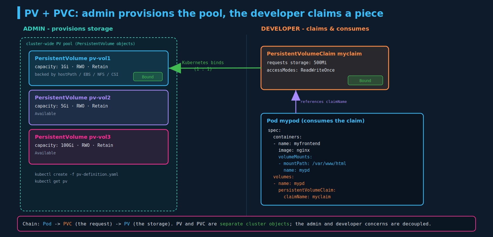

# Persistent Volumes & Persistent Volume Claims

> **Section:** 07-storage
> **Course chapter:** 4 (Persistent Volumes + Persistent Volume Claims)
> **Why this is in CKAD:** Core, heavily examinable. You'll write PVs and PVCs, bind them, consume a PVC from a pod, and reason about access modes and reclaim policy. The **1:1 binding** rule and the **`persistentVolumeClaim.claimName`** wiring are common task pieces.
> **Companion files:** `03-kubernetes-volumes.md` (volumes/volumeMounts, the multi-node `hostPath` problem this solves). Forward to StorageClasses / dynamic provisioning, which is where the "carve up a pool" idea actually lives.

---

## 1. Why PV/PVC exist (instructor framing)

In the last chapter the volume was defined **inside each pod**. That doesn't scale: on a big cluster with many users, every user would have to know and configure storage details in every pod — lots of duplicated, error-prone config. Better to **manage storage centrally**: an **administrator** provisions a pool of storage, and **users carve out pieces as they need them**.

Kubernetes splits this into **two separate cluster objects**:

- **PersistentVolume (PV)** — a cluster-wide piece of storage, provisioned by the **admin**.
- **PersistentVolumeClaim (PVC)** — a **user's request** for storage. Kubernetes **binds** the claim to a matching PV.



This is a clean separation of concerns: the admin worries about *what storage exists and how it's backed*; the developer just says *"I need 500Mi, read-write"* and consumes the result. The chain is **Pod → PVC → PV**.

---

## 2. PersistentVolume (PV)

Admin-created. Key fields: `accessModes`, `capacity.storage`, and a backend (the lecture shows `awsElasticBlockStore`; for labs use `hostPath`).

```yaml
apiVersion: v1
kind: PersistentVolume
metadata:
  name: pv-vol1
spec:
  accessModes:
    - ReadWriteOnce
  capacity:
    storage: 1Gi
  hostPath:                 # labs; in prod this is normally a CSI/StorageClass-provisioned backend
    path: /data
```

```bash
kubectl create -f pv-definition.yaml
kubectl get pv
# NAME      CAPACITY   ACCESS MODES   RECLAIM POLICY   STATUS      CLAIM   STORAGECLASS   AGE
# pv-vol1   1Gi        RWO            Retain           Available                          3m
```

**Access modes** (how the volume may be mounted):

| Mode | Short | Meaning |
|---|---|---|
| `ReadWriteOnce` | RWO | mounted read-write by a **single node** (not a single *pod* — see gotcha) |
| `ReadOnlyMany` | ROX | mounted read-only by many nodes |
| `ReadWriteMany` | RWX | mounted read-write by many nodes (needs a backend that supports it, e.g. NFS) |
| `ReadWriteOncePod` | RWOP | mounted read-write by a **single pod** (beyond the lecture; GA in 1.29) |

> **Correction (in-tree plugin):** the slide's inline `awsElasticBlockStore:` is a deprecated in-tree plugin (same note as `03`). On a current cluster, PVs for cloud storage are normally **dynamically provisioned by a StorageClass via CSI**, not hand-written with inline cloud blocks. For practice on kind, use `hostPath`.

**PV status lifecycle:** `Available` → `Bound` (claimed) → `Released` (PVC deleted, but data may remain) → `Failed`.

---

## 3. PersistentVolumeClaim (PVC)

User-created. It's a *request*: how much storage, which access mode.

```yaml
apiVersion: v1
kind: PersistentVolumeClaim
metadata:
  name: myclaim
spec:
  accessModes:
    - ReadWriteOnce
  resources:
    requests:
      storage: 500Mi
```

```bash
kubectl create -f pvc-definition.yaml
kubectl get pvc
# NAME      STATUS    VOLUME    CAPACITY   ACCESS MODES
# myclaim   Pending                                        <- then Bound once a PV matches
```

Note the asymmetry: a **PV** declares `capacity` (what it *has*); a **PVC** declares `resources.requests` (what it *wants*).

---

## 4. Binding — and resolving your confusion

When you create a PVC, Kubernetes looks for a PV that satisfies **all** of these criteria, then binds them:


- **Sufficient capacity** — PV `capacity` ≥ PVC `request`
- **Access modes** — compatible (the PV offers a mode the PVC asks for)
- **Volume mode** — `Filesystem` (default) vs `Block` must match
- **Storage class** — `storageClassName` must be equal
- **Selector (optional)** — if you set `spec.selector.matchLabels` on the PVC, only PVs with matching labels qualify (used to pick a *specific* PV when several would otherwise match)

```yaml
# PV
metadata:
  labels:
    name: my-pv
---
# PVC
spec:
  selector:
    matchLabels:
      name: my-pv
```

### Your confusion, resolved

You wrote: *"isn't this the point of allocating a large PV and then carving it out amongst users? But he said there's a one-to-one relationship..."* — both statements are true, and the catch is **what gets carved**:

- **Binding is strictly 1 PVC : 1 PV.** Once bound, that PV belongs to that one claim, exclusively.
- If a **500Mi** claim is matched to a **1Gi** PV (because that's the smallest available that satisfies it), the claim binds to the **whole** PV. The extra **500Mi is not handed to anyone else** — it's locked to that bound PV and effectively wasted. A single PV is **never split** across multiple claims.
- So **"carving up a large pool" is not "splitting one PV."** The pool is either **many PV objects** (the admin pre-creates a bunch of differently-sized PVs, each claimed 1:1), or — far more common today — a **StorageClass** that **dynamically provisions a right-sized PV per claim** from the backing storage system. *That* dynamic, per-claim provisioning is the real "carving," and it's the next lecture. The 1:1 rule is about **object-to-object binding**, while "carving the pool" is about the **backend** being subdivided into many PV objects.

**If no PV satisfies the claim, the PVC stays `Pending`** until a matching PV appears (or a StorageClass provisions one).

---

## 5. Using a PVC in a pod

Once the PVC is bound, a pod consumes it by naming the claim under `volumes` (then mounting it like any volume):

```yaml
apiVersion: v1
kind: Pod
metadata:
  name: mypod
spec:
  containers:
  - name: myfrontend
    image: nginx
    volumeMounts:
    - mountPath: /var/www/html
      name: mypd
  volumes:
  - name: mypd
    persistentVolumeClaim:
      claimName: myclaim          # <- the link to the PVC
```

Same pattern for Deployments/ReplicaSets — put it in the **pod template** (`spec.template.spec`). Notice this is the exact `volumes`/`volumeMounts` wiring from `03`; the only change is the volume *source* is now `persistentVolumeClaim` instead of `hostPath`/`emptyDir`.

---

## 6. Reclaim policy — what happens when the PVC is deleted

`kubectl delete pvc myclaim` removes the claim. What happens to the **PV** (and its data) is governed by the PV's **`persistentVolumeReclaimPolicy`**:

| Policy | What happens to the PV |
|---|---|
| **Retain** (default for static PVs) | PV and its data are **kept**; PV moves to `Released`. It is **not** auto-reused — an admin must manually clean up and recreate/reclaim it. |
| **Delete** | the PV (and usually the underlying storage asset) is **deleted**. Common for dynamically provisioned volumes. |
| **Recycle** (**deprecated**) | data was scrubbed (`rm -rf /scrub/*`) and the PV made `Available` again. |

> **Why Recycle is deprecated (your reasoning is right):** a naive `rm -rf` is **not a real reclaim**. It doesn't guarantee the space is truly free and safe to reuse — leftover **filesystem metadata, snapshots, and inode entries** can remain, you can hit **permission issues**, and there's no secure-wipe guarantee (a real concern for multi-tenant clusters where the next claimant must not see prior data). Properly reclaiming storage needs far more than file deletion, so Kubernetes dropped Recycle in favor of **dynamic provisioning + `Delete`** (let the storage system handle teardown) or admin-managed **`Retain`**.

> **Storage-object-in-use protection (exam-adjacent gotcha):** if you try to delete a PVC that's **still mounted by a running pod**, the PVC won't disappear — it stays `Terminating` (a finalizer holds it) until the pod stops using it. Same protection keeps a bound PV from vanishing out from under a PVC. So "my PVC won't delete" usually means a pod is still using it.

---

## Imperative / command reference

No clean generator — write the YAML (small specs, fast to type):

```bash
kubectl get pv ; kubectl get pvc
kubectl describe pv pv-vol1          # shows Status, Claim, Reclaim Policy, events
kubectl describe pvc myclaim         # shows Bound volume, capacity, events (why Pending?)
kubectl explain pv.spec              # discover fields: accessModes, capacity, reclaim policy...
kubectl explain pvc.spec
kubectl get pvc myclaim -o jsonpath='{.spec.volumeName}'   # which PV it bound to
kubectl delete pvc myclaim           # may hang (Terminating) if a pod still uses it
```

---

## Exam-pattern gotchas

- **PV and PVC are separate objects; binding is 1:1.** An oversized PV is claimed whole — spare capacity is wasted, never re-shared.
- **`RWO` = one *node*, not one *pod*.** Multiple pods on the same node can share an RWO volume. Use **`ReadWriteOncePod`** for true single-pod.
- **`storageClassName` must match** to bind. Empty `""` binds only to PVs with no class (pure static); **omitting** it lets the **default StorageClass** provision dynamically — different behavior, easy to trip on.
- **PVC `Pending`** = no PV matches (capacity/access/class/selector) **or** no provisioner for dynamic. `describe pvc` tells you which.
- **Consume via** `volumes.persistentVolumeClaim.claimName`; for Deployments it goes in the **pod template**.
- **`Retain`** leaves the PV `Released` and **not reusable** until an admin intervenes. **`Recycle`** is deprecated.
- **Capacity isn't always enforced** as a hard quota by the backend (e.g. `hostPath` won't stop you exceeding 1Gi) — it's primarily a *matching* attribute. (Beyond lecture; true enforcement depends on the storage type.)
- Deleting a PVC **in use by a pod** blocks until the pod releases it (finalizer).

---

## TL;DR / takeaways

- **PV** (admin-provisioned storage) and **PVC** (developer's request) are **separate objects**; Kubernetes **binds** them. Chain: **Pod → PVC → PV**.
- **Binding criteria:** sufficient capacity, access modes, volume mode, storage class, optional label selector.
- **Binding is 1:1.** A claim takes a **whole** PV; an oversized PV's spare capacity is **wasted**, never split among claims. "Carving up the pool" = **many PV objects** or **dynamic provisioning via a StorageClass**, *not* dividing one PV.
- **Access modes:** RWO (one node), ROX (many read-only), RWX (many read-write); RWOP = one pod.
- **Consume a PVC** in a pod via `volumes.persistentVolumeClaim.claimName`.
- **Reclaim policy:** `Retain` (keep, manual cleanup, → `Released`), `Delete` (remove PV + storage), `Recycle` (**deprecated** — `rm -rf` is an insufficient/insecure reclaim).

---

## Resolved threads

- [x] **"Carve up a big PV among users" vs "1:1 binding"** — binding is strictly 1 PVC : 1 PV; an oversized PV is claimed whole (spare wasted). "Carving" happens across **many PV objects** or via **dynamic provisioning (StorageClass)**, not by splitting one PV. Diagram 09.
- [x] **PV ↔ PVC relationship** — separate objects, bound by matching criteria; selectors/labels pick a specific PV when several match.
- [x] **Why `Recycle` is deprecated** — `rm -rf` doesn't securely/fully reclaim (metadata, snapshots, inodes, permissions); replaced by dynamic provisioning + `Delete` or `Retain`.
- [x] **Multi-node `hostPath` problem** (from `03`) — PV/PVC + a real backend is the path toward the proper fix; the full fix (dynamic, shared storage) is the StorageClass lecture.

### Open threads

- [ ] On **kind**: it ships a default StorageClass (local-path-provisioner), so a PVC with no `storageClassName` will **auto-bind to a dynamically created PV** — create one and watch it go `Bound` with no PV hand-written. Then do the **static** flow: hand-write a `hostPath` PV + a matching PVC and watch them bind 1:1.
- [ ] Reproduce **`Pending`**: create a PVC requesting more than any PV offers, `describe` it to read the "no volume matches" event.
- [ ] Test **in-use protection**: mount a PVC in a pod, try to `delete pvc`, watch it sit `Terminating` until the pod is gone.
- [ ] **Next lecture:** **StorageClasses / dynamic provisioning** — where the "carve a right-sized PV per claim" idea (and the CSI thread from `02`) becomes concrete: a `StorageClass` names a **provisioner**, and a PVC referencing it triggers automatic PV creation. Next file = `05-...`; next diagram = `10-...`.
