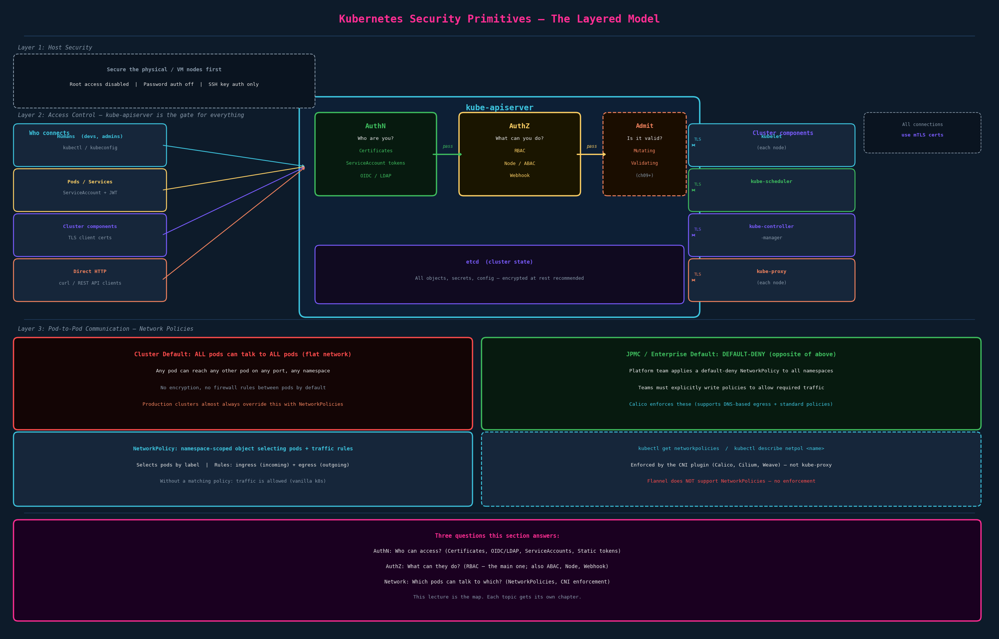

# Security Primitives

## What This Section Is

This lecture is a map. It names every security surface in a Kubernetes cluster, clusters them into categories, and signals what's coming. Each mechanism shown here gets its own lecture later. These notes go deeper on each mechanism than the intro did — you asked for it, and the mental model will make the detailed lectures land faster.



---

## Layer 0: Host Security

Before Kubernetes security matters, the nodes themselves need to be hardened:

- **Root access disabled** — no one logs in as root; use `sudo` with audit trail if needed
- **Password-based authentication off** — passwords are brute-forceable and leaked in breaches
- **SSH key authentication only** — asymmetric crypto; the private key never leaves the owner's machine
- Unnecessary ports closed; OS packages kept patched

This is pre-Kubernetes security hygiene. Kubernetes-level security is meaningless if someone can SSH into the control-plane node with a password and edit etcd directly.

---

## Layer 1: The API Server Is the Gate

Everything in Kubernetes goes through `kube-apiserver`. `kubectl`, applications, other cluster components — they all talk to the API server. Securing it is the first and most important layer.

There are two questions the API server asks about every request:

1. **Authentication: Who are you?** Verify the identity of the caller
2. **Authorization: What can you do?** Decide if that identity is allowed to perform the requested action

After those two gates comes a third — Admission Control (validates/mutates the request; dedicated chapter later). Think of it as: AuthN → AuthZ → Admission → etcd write.

---

## Authentication — Who Can Access?

### Certificates (X.509) — the standard

The cluster has a Certificate Authority (CA). Client certificates are issued by this CA. The certificate's `CN` (Common Name) field becomes the username; the `O` (Organization) field becomes the group.

```
# kubectl reads this from kubeconfig
users:
  - name: casey
    user:
      client-certificate: /path/to/casey.crt
      client-key: /path/to/casey.key
```

The API server validates the cert against the cluster CA. No password, no token — just cryptographic proof that the cert was signed by the trusted CA.

This is also how all cluster components authenticate to the API server: kubelet, kube-scheduler, kube-controller-manager, kube-proxy each have their own client cert signed by the cluster CA.

### External Authentication Providers — OIDC and LDAP

Delegate authentication to an external identity system.

**OIDC (OpenID Connect):** The modern enterprise approach. User authenticates with an Identity Provider (Azure AD, Google, Okta, Dex, JPMC's SSO). The IdP issues a JWT token. kubectl presents this JWT in the `Authorization: Bearer` header. The API server validates the JWT's signature against the IdP's public key without contacting the IdP on every request.

**LDAP:** Older enterprise directory protocol. Usually implemented via an authenticating proxy (like Dex) that speaks OIDC to Kubernetes and LDAP to the directory, rather than LDAP directly to Kubernetes.

### `klogin <cluster>` at JPMC

`klogin` is JPMC's internal tool for authenticating to a cluster. Based on the enterprise pattern, it almost certainly does:

1. Initiates authentication against JPMC's identity provider (likely Azure AD or an internal SSO system)
2. Gets a short-lived token or client certificate
3. Writes credentials to `~/.kube/config` (`users[].user.token` or cert fields)
4. Sets the current context to the target cluster

This is **Authentication** in Kubernetes terms — specifically External Authentication Provider (OIDC) or certificate issuance. After `klogin`, every `kubectl` command you run presents those credentials to the API server, which validates them before doing anything.

Your limited permissions at work come from the **Authorization** layer (RBAC), not authentication. Authentication just proves who you are; RBAC decides what you're allowed to do as that identity.

### Service Accounts

For pods, not humans. A ServiceAccount is a namespaced object that provides an identity for a pod to make API calls.

```yaml
apiVersion: v1
kind: ServiceAccount
metadata:
  name: my-app
  namespace: default
```

When a pod specifies `serviceAccountName: my-app`, Kubernetes auto-mounts a JWT token at `/var/run/secrets/kubernetes.io/serviceaccount/token`. The pod uses this token to authenticate API requests. Every namespace has a `default` ServiceAccount that pods use unless you specify otherwise.

Service accounts + RBAC = how in-cluster applications access the Kubernetes API safely (e.g., an operator reading deployments, a controller watching pods).

### Static Token File — deprecated, don't use

A CSV file on the API server host containing tokens. Specified via `--token-auth-file`. Requires server restart to add/remove tokens. Tokens stored in plaintext. No rotation. No audit. Never use in any real environment.

---

## Authorization — What Can They Do?

Once authenticated, every request goes through the authorization layer.

### RBAC — Role-Based Access Control (the one that matters)

RBAC is how virtually every production Kubernetes cluster controls access. Four objects:

| Object | Scope | Purpose |
|---|---|---|
| `Role` | Namespace | Defines allowed verbs on resources in one namespace |
| `ClusterRole` | Cluster | Same but applies cluster-wide or to non-namespaced resources |
| `RoleBinding` | Namespace | Grants a Role to a user/group/ServiceAccount in one namespace |
| `ClusterRoleBinding` | Cluster | Grants a ClusterRole to a user/group/ServiceAccount cluster-wide |

```yaml
# Who can do what in the default namespace
kind: Role
apiVersion: rbac.authorization.k8s.io/v1
metadata:
  name: pod-reader
  namespace: default
rules:
  - apiGroups: [""]
    resources: ["pods"]
    verbs: ["get", "list", "watch"]
---
kind: RoleBinding
apiVersion: rbac.authorization.k8s.io/v1
metadata:
  name: read-pods
  namespace: default
subjects:
  - kind: User
    name: casey
    apiGroup: rbac.authorization.k8s.io
roleRef:
  kind: Role
  name: pod-reader
  apiGroup: rbac.authorization.k8s.io
```

Your limited operations at JPMC are RBAC in action. The platform team created a Role (or ClusterRole) with a specific set of verbs and resources, bound it to your user or an AD group you're in. When you run `kubectl delete pod` and it's denied, the API server ran the RBAC check: "Does user `casey` have the `delete` verb on `pods` in namespace `700515d201053-caas-dev`?" — and got no.

### ABAC — Attribute-Based Access Control (effectively deprecated)

Policy documents stored as JSON lines on the API server. Each line: `{"apiVersion":"abac.authorization.kubernetes.io/v1beta1","kind":"Policy","spec":{"user":"casey","namespace":"*","resource":"pods","readonly":true}}`. Adding or changing policies requires restarting the API server. Not practical. Replaced by RBAC in all modern clusters.

### Node Authorization

A purpose-built authorizer for kubelets. Kubelet needs to read Secrets, ConfigMaps, and PersistentVolumes for pods on its node. Node authorization enforces that a kubelet on node A can only read secrets for pods running on node A — it cannot read secrets for pods on node B. This prevents a compromised node from escalating to cluster-wide secret access.

This uses the `Node` authorizer mode alongside `RBAC`. Kubelets identify themselves with certs in the `system:nodes` group and `system:node:<nodename>` username format. CKA/CKS-level topic but good to know it exists.

### Webhook Mode

Delegates authorization decisions to an **external HTTP service**. When a request comes in, the API server makes an HTTP POST to your webhook URL with a `SubjectAccessReview` object describing the request. The external service returns `allowed: true` or `allowed: false`.

**What is a webhook, exactly?** A webhook is an HTTP callback pattern — "don't call us, we'll call you." Instead of Kubernetes making an internal decision, it sends an HTTP request to your endpoint with the event data and waits for a response. The webhook receiver is in control of the logic; Kubernetes just supplies the data. It's the opposite of polling (where the receiver would repeatedly ask Kubernetes "anything happened?"). Webhooks are used throughout Kubernetes: authorization webhooks, admission webhooks, audit webhooks — any time you need to extend Kubernetes behavior with external logic.

In authorization webhooks specifically, common uses:
- **OPA (Open Policy Agent)** / Gatekeeper — policy-as-code enforcement; write authorization rules in Rego
- **Azure AD RBAC** — map Azure AD group membership to Kubernetes permissions
- **Custom authorization logic** — multi-tenant systems, dynamic policy from a database, etc.

---

## TLS Between Cluster Components

Every connection between Kubernetes components is TLS-encrypted using client certificates. The API server is in the middle — every other component authenticates to it:

| Component | How it authenticates to API server |
|---|---|
| kubelet | Client cert: `CN=system:node:<nodename>` |
| kube-scheduler | Client cert: `CN=system:kube-scheduler` |
| kube-controller-manager | Client cert: `CN=system:kube-controller-manager` |
| kube-proxy | Client cert |
| etcd ↔ API server | Mutual TLS; API server has an etcd client cert |

All certs signed by the cluster CA. Rotate them and nothing breaks except the brief window during rotation. CKA covers certificate rotation in depth; CKS covers PKI management.

---

## Network Policies — Which Pods Can Talk to Which?

### The default: flat network, no restrictions

In a vanilla Kubernetes cluster, every pod can reach every other pod on any port, across any namespace, with no rules. This is by design — Kubernetes assumes a trusted network by default. The "flat network" model means no pod-level firewall out of the box.

### NetworkPolicies

A NetworkPolicy is a namespace-scoped resource that selects pods (by label) and defines allowed ingress (incoming) and egress (outgoing) traffic rules.

```yaml
# Allow only pods with app=frontend to reach app=backend on port 8080
kind: NetworkPolicy
apiVersion: networking.k8s.io/v1
metadata:
  name: backend-allow-frontend
  namespace: default
spec:
  podSelector:
    matchLabels:
      app: backend
  ingress:
    - from:
        - podSelector:
            matchLabels:
              app: frontend
      ports:
        - port: 8080
```

Without any NetworkPolicy, all traffic is allowed. When a NetworkPolicy selects a pod, it becomes the policy for that pod — any traffic not explicitly listed in the policy is dropped.

**Critical:** NetworkPolicies are only enforced by CNI plugins that support them: **Calico**, Cilium, Weave. **Flannel does not** enforce NetworkPolicies — you can apply them but they have no effect. kube-proxy is not involved.

### JPMC: default-deny model

Your observation is correct — JPMC does the opposite of the cluster default. The platform team (using Calico) applies default-deny NetworkPolicies to all namespaces. Your team then writes explicit allow policies for the traffic you need.

This is the security-correct approach. Default-deny means: if you haven't explicitly said this traffic is allowed, it's blocked. It forces teams to reason about what their services actually need to communicate with, which reduces blast radius when something is compromised. Calico also supports DNS-based egress policies (e.g., allow pods to call `api.external.com`) which standard Kubernetes NetworkPolicy doesn't support.

---

## What the Upcoming Chapters Cover

This lecture is the topology. Here's what each upcoming chapter addresses:

| Topic | What it covers |
|---|---|
| Authentication (ch02) | Certificates in depth: creating, signing, kubeconfig |
| RBAC (ch03) | Roles, RoleBindings, ClusterRoles, `kubectl auth can-i` |
| Service Accounts (ch04) | Creating SAs, mounting tokens, automounting |
| TLS (ch05) | Certificate mechanics, CA, cert signing requests |
| Network Policies (ch06) | Writing policies, ingress/egress rules, deny-all patterns |

---

## TL;DR

Kubernetes security is layered: secure the hosts first (SSH keys, no root), then secure the API server (authentication + authorization), then the components talk to each other via TLS, then pod-to-pod traffic is controlled by NetworkPolicies. Authentication answers "who are you?" (certificates, OIDC/LDAP, service accounts). Authorization answers "what can you do?" (RBAC is the standard; ABAC is deprecated; Node auth protects kubelets; Webhook delegates to external services). The vanilla cluster default allows all pod communication — production clusters invert this with default-deny NetworkPolicies. Your `klogin <cluster>` is the Authentication step; your limited kubectl permissions are the RBAC Authorization step.

---

## Open Threads

- [ ] Certificate mechanics in depth — how certs are issued, CA, CSR (Certificate Signing Request), kubeconfig file structure (ch02)
- [ ] RBAC deep dive — writing Roles and Bindings, `kubectl auth can-i`, auditing permissions (ch03)
- [ ] ServiceAccount mechanics — automount behavior, projected tokens, workload identity (ch04)
- [ ] Admission Controllers — the third gate after AuthN/AuthZ; MutatingWebhookConfiguration, ValidatingWebhookConfiguration (ch05+)
- [ ] Network Policies in full — default-deny pattern, ingress vs egress, namespace selectors, namespaceSelector + podSelector AND behavior (ch06)
- [ ] OPA/Gatekeeper — policy-as-code via webhook mode; CKS territory but relevant for enterprise context
- [ ] OIDC configuration on kube-apiserver — `--oidc-issuer-url`, `--oidc-client-id`, token validation mechanics (CKA-level)
