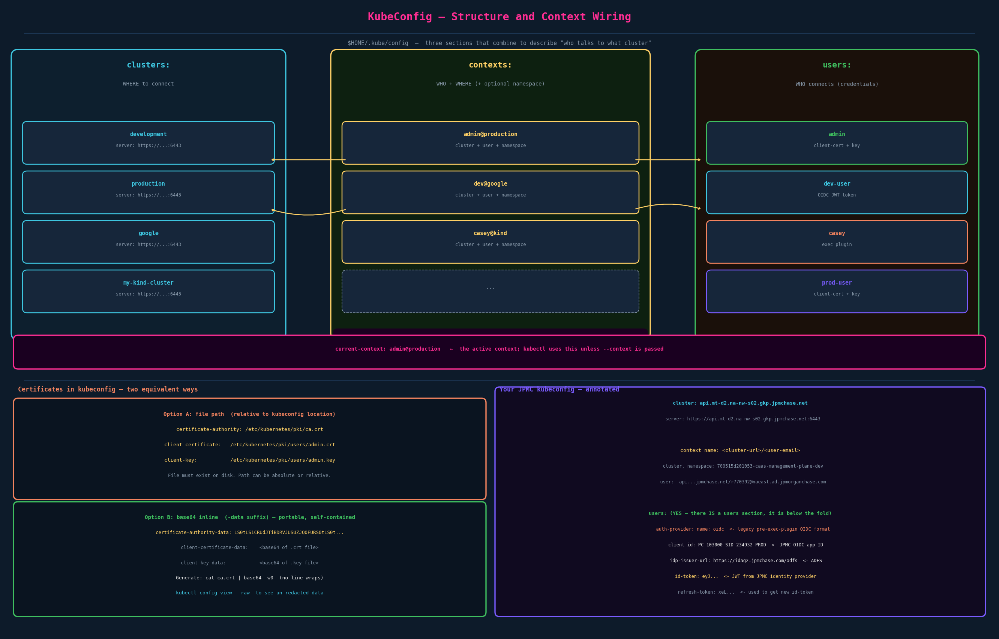

# KubeConfig

> **CKA note:** generating certificates for Kubernetes components (CSR signing, CA, kubelet certs) is CKA/CKS scope. This chapter covers kubeconfig — how to use and manage the credentials file. That's fully in CKAD scope and is tested.

## Why kubeconfig Exists

Without kubeconfig, every kubectl command requires explicit flags:

```bash
kubectl get pods \
  --server https://my-kube-playground:6443 \
  --client-key admin.key \
  --client-certificate admin.crt \
  --certificate-authority ca.crt
```

That's four flags every time, for every command. kubeconfig stores all of that once and kubectl reads it automatically. It also lets a single file manage credentials for multiple clusters and multiple users simultaneously, with a concept called a context that selects which combination is active.

Default location: `$HOME/.kube/config`. No `--kubeconfig` flag needed when using this path.

---

## The Three Sections



kubeconfig has exactly three lists:

### `clusters:`
Describes the clusters you connect to. Each entry has a name and the cluster's connection details: server URL and the CA certificate that signed the API server's TLS cert.

```yaml
clusters:
  - name: production
    cluster:
      server: https://172.17.0.51:6443
      certificate-authority: /etc/kubernetes/pki/ca.crt
      # or inline: certificate-authority-data: <base64>
```

### `users:`
Describes the identities/credentials available. Each entry has a name and the credential material.

```yaml
users:
  - name: admin
    user:
      client-certificate: /etc/kubernetes/pki/users/admin.crt
      client-key: /etc/kubernetes/pki/users/admin.key
```

### `contexts:`
The "marriage" — each context pairs one cluster entry with one user entry. Optionally sets a default namespace. The name is arbitrary but `user@cluster` is the convention.

```yaml
contexts:
  - name: admin@production
    context:
      cluster: production    # must match a name in clusters:
      user: admin            # must match a name in users:
      namespace: finance     # optional — default namespace for this context
```

**The context does not control access.** It's a shortcut that says "when kubectl runs with this context active, use these credentials to talk to this cluster." RBAC on the server side decides what that user can actually do.

---

## current-context — The Active Selection

```yaml
current-context: admin@production
```

This single field determines which context kubectl uses when no `--context` flag is provided. Change it with `kubectl config use-context`.

---

## Full Working Example

```yaml
apiVersion: v1
kind: Config
current-context: admin@production

clusters:
  - name: development
    cluster:
      server: https://dev.example.com:6443
      certificate-authority-data: LS0tLS1CRUdJTi...   # base64 encoded CA cert
  - name: production
    cluster:
      server: https://172.17.0.51:6443
      certificate-authority: /etc/kubernetes/pki/ca.crt

contexts:
  - name: admin@production
    context:
      cluster: production
      user: admin
      namespace: finance
  - name: dev@development
    context:
      cluster: development
      user: dev-user

users:
  - name: admin
    user:
      client-certificate: /etc/kubernetes/pki/users/admin.crt
      client-key: /etc/kubernetes/pki/users/admin.key
  - name: dev-user
    user:
      token: eyJhbGciOiJSUzI1NiIs...   # OIDC JWT or ServiceAccount token
```

---

## Certificates in kubeconfig — Path vs Inline

There are two ways to reference certificate material. They are equivalent; kubectl handles both.

**Option A — file path:**
```yaml
certificate-authority: /etc/kubernetes/pki/ca.crt
client-certificate:    /etc/kubernetes/pki/users/admin.crt
client-key:            /etc/kubernetes/pki/users/admin.key
```
The file must exist on disk at the specified path. Convenient when managing certs separately (e.g., cert rotation replaces the file without touching kubeconfig).

**Option B — base64 inline (`-data` suffix):**
```yaml
certificate-authority-data: LS0tLS1CRUdJTiBDRVJUSUZJQ0FURS0tLS0t...
client-certificate-data:    <base64 of .crt file>
client-key-data:            <base64 of .key file>
```
The cert is embedded directly in the file. The file is self-contained — you can send it to another machine without also copying the cert files. This is what `kubectl config view` shows as `REDACTED` by default and what kubeadm-generated configs use.

To convert a cert file to base64 for pasting into kubeconfig:
```bash
cat ca.crt | base64 -w0    # -w0 prevents line wrapping (Linux)
cat ca.crt | base64         # macOS (no -w flag needed)
```

To see the actual data (not redacted):
```bash
kubectl config view --raw
```

---

## Your JPMC kubeconfig — What You're Looking At

Looking at your actual file, every section IS present — the file is just long because the tokens are large base64 blobs that push the `users:` section far down the screen.

**Cluster section:**
```yaml
clusters:
- cluster:
    server: https://api.mt-d2.na-nw-s02.gkp.jpmchase.net:6443
  name: api.mt-d2.na-nw-s02.gkp.jpmchase.net
```
`api.mt-d2.na-nw-s02.gkp.jpmchase.net` is the DNS name of your JPMC API server. The `mt-d2` / `na-nw-s02` portion suggests it's a managed/internal cluster in a North America region. `gkp.jpmchase.net` is JPMC's internal domain for their Kubernetes platform (Google Kubernetes Platform? or their internal GKP platform).

**Context section:**
```yaml
contexts:
- context:
    cluster: api.mt-d2.na-nw-s02.gkp.jpmchase.net
    namespace: 700515d201053-caas-management-plane-dev
    user: api.mt-d2.na-nw-s02.gkp.jpmchase.net/r770392@naeast.ad.jpmorganchase.com
  name: api.mt-d2.na-nw-s02.gkp.jpmchase.net/r770392@naeast.ad.jpmorganchase.com
```
JPMC's naming convention is `<cluster-url>/<user-email>` for both the user name and context name. `r770392` is your network ID. `naeast.ad.jpmorganchase.com` is JPMC's Active Directory domain (naeast = North America East region AD).

The `namespace: 700515d201053-caas-management-plane-dev` means every kubectl command you run in this context defaults to that namespace without needing `-n`. That's why you don't have to type the namespace every time.

**Users section** (below the long token blob):
```yaml
users:
- name: api.mt-d2.na-nw-s02.gkp.jpmchase.net/r770392@naeast.ad.jpmorganchase.com
  user:
    auth-provider:
      config:
        client-id: PC-103000-SID-234932-PROD       # JPMC's registered OIDC app ID
        client-secret: ""
        id-token: eyJ0eXAi...                       # Your current JWT (huge base64)
        idp-issuer-url: https://idag2.jpmchase.com/adfs  # JPMC's ADFS (AD Federation Services)
        refresh-token: xeLlx...                     # Used to get a new id-token when it expires
      name: oidc
```

A few things to note here:

**`auth-provider: name: oidc`** — this is the *legacy* OIDC authentication format in kubeconfig, predating the `exec:` plugin approach. It was deprecated in client-go v1.22 and removed in v1.26. JPMC's internal kubectl build or tooling may keep this working, or they're pinned to an older kubectl version. The concept is identical to the OIDC exec plugin — just an older API shape.

**`idp-issuer-url: https://idag2.jpmchase.com/adfs`** — ADFS stands for Active Directory Federation Services. This is Microsoft's enterprise SSO/OIDC provider built into Windows Server. JPMC runs ADFS to provide OIDC tokens backed by their Active Directory. When `klogin` runs, it authenticates with ADFS (probably via Kerberos — tying back to ch02), and ADFS issues the `id-token` you see here.

**`id-token`** — the big base64 blob. This is the JWT that kubectl presents to the API server as your credential. If you paste it into [jwt.io](https://jwt.io) you'd see your identity claims (user, groups, expiry). **This is sensitive data** — anyone with this token can impersonate you until it expires (typically 1 hour for JPMC tokens).

**`refresh-token`** — when the `id-token` expires, kubectl uses the refresh token to get a new `id-token` from ADFS without re-prompting you. If the refresh token also expires, you need to run `klogin` again.

---

## kubectl config Commands — Complete Reference

```bash
# ── Viewing ──────────────────────────────────────────────────────
kubectl config view                     # print kubeconfig (certs redacted)
kubectl config view --raw               # print with actual cert data
kubectl config view --minify            # print only current context's entries
kubectl config view --kubeconfig=<file> # view a specific file

# ── Contexts ─────────────────────────────────────────────────────
kubectl config current-context          # show active context name
kubectl config get-contexts             # list all contexts (active marked with *)
kubectl config use-context <name>       # switch active context
kubectl config delete-context <name>    # remove a context

# ── Set default namespace for current context ────────────────────
kubectl config set-context --current --namespace=<ns>
# This is probably the most-used config command day-to-day.
# After this, kubectl get pods works without -n <ns>

# ── Modifying entries ────────────────────────────────────────────
kubectl config set-cluster <name> \
  --server=https://api.example.com:6443 \
  --certificate-authority=/path/to/ca.crt

kubectl config set-credentials <name> \
  --client-certificate=/path/to/user.crt \
  --client-key=/path/to/user.key

kubectl config set-context <name> \
  --cluster=<cluster-name> \
  --user=<user-name> \
  --namespace=<ns>

# ── Per-command overrides ─────────────────────────────────────────
kubectl get pods --context=dev@development          # use different context once
kubectl get pods --kubeconfig=/tmp/other-config     # use a different file entirely
kubectl -n kube-system get pods                     # override namespace for one command

# ── Renaming ─────────────────────────────────────────────────────
kubectl config rename-context <old> <new>
```

---

## Multiple kubeconfig Files

You don't have to cram everything into one file. The `KUBECONFIG` environment variable accepts a colon-separated list of paths. kubectl merges them at runtime:

```bash
export KUBECONFIG=~/.kube/config:~/.kube/work-config:~/.kube/personal-config
kubectl config get-contexts   # shows contexts from all three files merged
```

To permanently set this, add the export to `~/.bashrc` or `~/.zshrc`.

At JPMC, `klogin` likely writes to a specific file or appends to `~/.kube/config`. You can check which file your current context is in:
```bash
kubectl config view --raw | grep -A3 current-context
```

---

## The Context → Namespace Mental Model

A context does not restrict what namespaces you can access (that's RBAC). It sets the *default* namespace for commands that need one. The namespace field in a context is equivalent to passing `-n <namespace>` on every kubectl command.

```yaml
contexts:
  - name: casey@jpmc
    context:
      cluster: jpmc-prod
      user: casey
      namespace: 700515d201053-caas-dev   # ← your default; override with -n
```

Without this: `kubectl get pods` → scoped to `default` namespace  
With this: `kubectl get pods` → scoped to `700515d201053-caas-dev`

You can always override with `-n <ns>` or `-A`/`--all-namespaces`.

---

## Exam-Pattern Gotchas

- **Context names are arbitrary strings.** `admin@production` is just a convention. The actual wiring is the `cluster:` and `user:` fields inside the context object.
- **`--context` vs `use-context`:** `--context` overrides for a single command; `use-context` changes `current-context` in the file permanently.
- **Missing `certificate-authority`** causes `x509: certificate signed by unknown authority`. The file must exist at the path specified or the base64 data must be correct.
- **`kubectl config view` redacts cert data** by default — use `--raw` to see it. On the exam, if asked to copy a CA cert into kubeconfig, use `certificate-authority-data` (base64).
- **`set-context --current`** modifies the currently active context, not a new one. This is the fastest way to change your default namespace.
- **`--kubeconfig` flag** takes a file path; `KUBECONFIG` env var takes a colon-separated list. They behave differently when merging is needed.
- **Namespaces in contexts are not written into manifests.** A `namespace: finance` in a context only affects kubectl default behavior; it doesn't appear in pod YAML.

---

## TL;DR

kubeconfig is a YAML file at `~/.kube/config` with three lists: `clusters` (where to connect), `users` (who connects + their credentials), and `contexts` (marriages of one cluster + one user + an optional default namespace). `current-context` selects the active context. Certificates are either file paths or base64-inlined with a `-data` suffix. Your JPMC kubeconfig uses the legacy OIDC `auth-provider` format with ADFS as the identity provider — there IS a users section, it's just buried below the enormous JWT blob in the `id-token` field. The two commands you'll use most: `kubectl config use-context` to switch clusters, and `kubectl config set-context --current --namespace=<ns>` to change your default working namespace.

---

## Open Threads

- [ ] Certificate generation — how to create user certs, sign CSRs against the cluster CA, issue short-lived certs (CKA scope; worth understanding before CKA)
- [ ] RBAC — what happens after kubeconfig establishes identity; Roles, RoleBindings (ch04 in this section)
- [ ] ServiceAccount kubeconfig — how to create a kubeconfig file for a ServiceAccount (used for CI/CD pipelines and automation)
- [ ] `KUBECONFIG` env var merging rules — what happens when two files define the same cluster name (first file wins for most fields)
- [ ] kubelogin / exec plugin setup for personal cluster — connecting your own cluster to Google/GitHub OIDC
