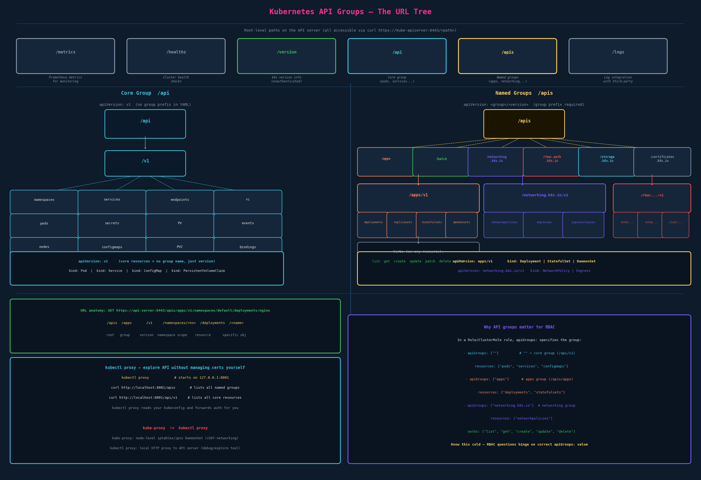

# API Groups

## Why API Groups Exist

The Kubernetes API started as a monolith — everything in `/api/v1`. As Kubernetes grew, new resource types needed independent versioning and a cleaner namespace. API groups solve this: resources are organized into named groups with their own version tracks. This lets `apps/v1` and `networking.k8s.io/v1` evolve independently, CRDs (custom resources) plug into the `/apis` namespace cleanly, and different feature areas can be in different stability stages simultaneously.

Every `apiVersion:` field in a YAML manifest maps directly to an API group and version in this tree.

---

## Root-Level Endpoints

```bash
curl https://kube-master:6443/version    # works unauthenticated; returns k8s version
curl https://kube-master:6443/healthz    # cluster health; used by load balancers + monitoring
curl https://kube-master:6443/metrics    # Prometheus metrics; scraped by metric systems
curl https://kube-master:6443/api        # core group entry point
curl https://kube-master:6443/apis       # named groups entry point
curl https://kube-master:6443/logs       # log forwarding to third-party systems
```

Most paths require authentication. Hit the root without certs and you get a 403:
```json
{
  "status": "Failure",
  "message": "forbidden: User \"system:anonymous\" cannot get path \"/\"",
  "reason": "Forbidden",
  "code": 403
}
```

`/version` is the only useful unauthenticated endpoint.

---

## The Two Groups



### Core Group — `/api`

The original group. No group name in the path. Resources live at:
```
/api/v1/<resource>
/api/v1/namespaces/<namespace>/<resource>/<name>
```

Resources in the core group: pods, services, endpoints, nodes, namespaces, configmaps, secrets, persistentvolumes, persistentvolumeclaims, serviceaccounts, events, replicationcontrollers, resourcequotas, bindings.

**In YAML:** `apiVersion: v1` — just the version, no group prefix.

```yaml
apiVersion: v1     # ← core group; no "group/" prefix
kind: Pod
---
apiVersion: v1
kind: Service
---
apiVersion: v1
kind: PersistentVolumeClaim
```

### Named Groups — `/apis`

Everything else. Resources live at:
```
/apis/<group>/<version>/<resource>
/apis/<group>/<version>/namespaces/<namespace>/<resource>/<name>
```

Key named groups:

| Group | `apiVersion:` | Key resources |
|---|---|---|
| `apps` | `apps/v1` | Deployment, StatefulSet, DaemonSet, ReplicaSet |
| `batch` | `batch/v1` | Job, CronJob |
| `networking.k8s.io` | `networking.k8s.io/v1` | NetworkPolicy, Ingress, IngressClass |
| `storage.k8s.io` | `storage.k8s.io/v1` | StorageClass, VolumeAttachment |
| `rbac.authorization.k8s.io` | `rbac.authorization.k8s.io/v1` | Role, ClusterRole, RoleBinding, ClusterRoleBinding |
| `autoscaling` | `autoscaling/v2` | HorizontalPodAutoscaler |
| `certificates.k8s.io` | `certificates.k8s.io/v1` | CertificateSigningRequest |
| `apiextensions.k8s.io` | `apiextensions.k8s.io/v1` | CustomResourceDefinition (CRDs) |

**In YAML:** `apiVersion: <group>/<version>`.

```yaml
apiVersion: apps/v1
kind: Deployment
---
apiVersion: networking.k8s.io/v1
kind: NetworkPolicy
---
apiVersion: rbac.authorization.k8s.io/v1
kind: ClusterRole
```

---

## URL Anatomy

Every kubectl command translates to an HTTP request against this URL tree:

```
GET https://api-server:6443/apis/apps/v1/namespaces/default/deployments/nginx

      /apis        = named groups root
           /apps   = group name
                /v1           = version
                   /namespaces/default   = namespace scope (omit for cluster-scoped)
                                      /deployments   = resource type
                                                   /nginx   = specific object
```

Cluster-scoped resources (nodes, namespaces, PVs, ClusterRoles) skip the `/namespaces/<name>` segment:
```
GET /apis/rbac.authorization.k8s.io/v1/clusterroles/cluster-admin
```

**Verbs map to HTTP methods:**

| kubectl verb | HTTP method | URL pattern |
|---|---|---|
| `get` | GET | `/.../<resource>/<name>` |
| `list` | GET | `/.../<resource>` |
| `create` | POST | `/.../<resource>` |
| `update` | PUT | `/.../<resource>/<name>` |
| `patch` | PATCH | `/.../<resource>/<name>` |
| `delete` | DELETE | `/.../<resource>/<name>` |
| `watch` | GET + `?watch=true` | `/.../<resource>` |

---

## Exploring the API

### Direct curl (requires certs)

```bash
# List root paths
curl https://localhost:6443 \
  --key admin.key --cert admin.crt --cacert ca.crt

# List all named API groups
curl https://localhost:6443/apis \
  --key admin.key --cert admin.crt --cacert ca.crt | grep '"name"'

# List resources in a group
curl https://localhost:6443/apis/apps/v1 \
  --key admin.key --cert admin.crt --cacert ca.crt
```

The `-k` flag skips TLS verification (only for local/test clusters):
```bash
curl https://localhost:6443/version -k
```

### kubectl proxy — the easier way

`kubectl proxy` starts a local HTTP server that reads your kubeconfig and forwards authentication. You can then curl without managing certs:

```bash
# Terminal 1 — start proxy
kubectl proxy
# Starting to serve on 127.0.0.1:8001

# Terminal 2 — explore without certs
curl http://localhost:8001                   # list root paths
curl http://localhost:8001/apis              # list named groups
curl http://localhost:8001/api/v1            # list core resources
curl http://localhost:8001/apis/apps/v1      # list apps group resources
```

The proxy runs as long as the terminal is open. Useful for debugging API calls or exploring the API structure. Also used by tools like the Kubernetes dashboard.

### API reference documentation

`https://kubernetes.io/docs/reference/generated/kubernetes-api/v1.33/`

Organized by resource. Each resource shows its API group (listed next to the kind), available fields, and sub-resources. This is the authoritative reference for YAML fields during the exam.

---

## `kube-proxy` ≠ `kubectl proxy`

These come up in the same breath and are completely different things:

| | `kube-proxy` | `kubectl proxy` |
|---|---|---|
| What it is | Kubernetes DaemonSet (node-level component) | CLI command |
| What it does | Maintains iptables/ipvs rules for Service routing | Local HTTP → API server forwarding |
| Who uses it | Kubernetes networking subsystem | You, for debugging |
| Runs on | Every node in the cluster | Your machine |
| Covered in | Networking section (ch07) | This chapter |

**One-line distinction:** `kube-proxy` is how pods find each other through Services. `kubectl proxy` is how you poke the API server without dealing with TLS.

---

## Why API Groups Matter for RBAC

This is the payoff of understanding the tree. When you write a Role or ClusterRole, `apiGroups:` is a required field that names the group containing the resources you're allowing access to.

```yaml
rules:
  # Core group: apiGroups: [""] — the empty string represents /api/v1
  - apiGroups: [""]
    resources: ["pods", "services", "configmaps", "secrets"]
    verbs: ["get", "list", "watch"]

  # apps group
  - apiGroups: ["apps"]
    resources: ["deployments", "statefulsets", "daemonsets", "replicasets"]
    verbs: ["get", "list", "watch", "create", "update", "patch", "delete"]

  # networking group
  - apiGroups: ["networking.k8s.io"]
    resources: ["networkpolicies", "ingresses"]
    verbs: ["get", "list", "watch"]
```

**Common mistake on the exam:** using `apiGroups: ["v1"]` or `apiGroups: ["core"]` instead of `apiGroups: [""]` for core resources. The core group name is the empty string `""`, not `"v1"` or `"core"`.

To look up the correct `apiGroups` value for any resource:
```bash
kubectl api-resources --sort-by=name
# Shows: NAME, SHORTNAMES, APIVERSION, NAMESPACED, KIND
# APIVERSION column = "<group>/<version>" or just "<version>" for core

kubectl api-resources | grep deployment
# deployments   deploy   apps/v1   true   Deployment
# → apiGroups: ["apps"]

kubectl api-resources | grep pod
# pods   po   v1   true   Pod
# → apiGroups: [""]  (v1 with no group = core = empty string)
```

---

## Exam Shortcuts

```bash
# Discover what API groups exist in the cluster
kubectl api-resources
kubectl api-versions     # shows all group/version strings available

# Check resource's full API path
kubectl api-resources --verbs=list --namespaced -o wide

# Explain any resource (shows apiVersion, description, fields)
kubectl explain deployment
kubectl explain pod.spec.containers

# Check what you can do (post-RBAC chapter — use alongside this)
kubectl auth can-i list pods --as=system:anonymous
kubectl auth can-i create deployments -n default
```

---

## TL;DR

The Kubernetes API is a URL tree rooted at the API server. Root-level paths (`/healthz`, `/metrics`, `/version`) are utility endpoints. Everything else lives under two branches: `/api` (core group — pods, services, configmaps, etc.) and `/apis` (named groups — apps, networking.k8s.io, rbac.authorization.k8s.io, etc.). The `apiVersion:` field in every YAML manifest is a direct encoding of this tree: `v1` = core group, `apps/v1` = apps named group. API groups are foundational to RBAC — the `apiGroups:` field in a Role rule must name the correct group for the resource, with `""` for core and the group name string for everything else. `kubectl proxy` is a local convenience tool for exploring the API; it has nothing to do with `kube-proxy` which is the cluster's service routing component.

---

## Open Threads

- [ ] RBAC deep dive — writing Roles, RoleBindings, ClusterRoles with correct apiGroups (ch05 this section)
- [ ] CRDs — how custom resources extend `/apis` with custom groups (advanced topic)
- [ ] API versioning and deprecation — how resources move from `v1alpha1` → `v1beta1` → `v1`; relevant for tracking when to update manifests
- [ ] `kubectl explain` — your best friend for discovering YAML fields during the exam; uses this API tree internally
