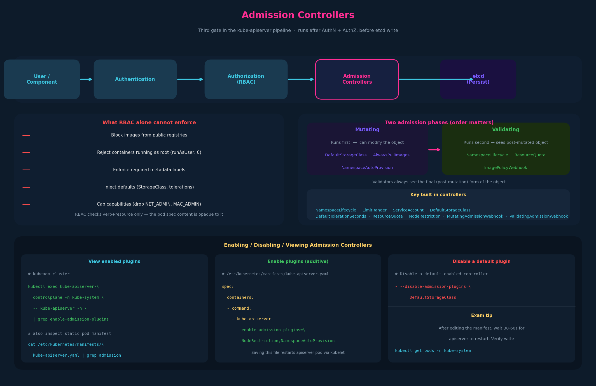

# 08 – Admission Controllers



---

## 1. Where admission controllers fit in the request pipeline

Every `kubectl` request travels through a fixed pipeline inside kube-apiserver
before anything gets written to etcd:

```
User/Component
    │
    ▼
kube-apiserver
    ├─ 1. Authentication  – who are you?
    ├─ 2. Authorization   – are you allowed to do this? (RBAC)
    ├─ 3. Admission       – should this object be admitted? (admission controllers)
    └─ 4. Persist to etcd → object created
```

Authentication and Authorization are already covered (chapters 02–06).
Admission controllers are the third gate — they run *after* the request is
authorized but *before* the object is persisted.

---

## 2. Why RBAC isn't enough

RBAC can answer: "is this user allowed to CREATE a pod in namespace X?"
It cannot answer: "should this specific pod manifest be admitted?"

The limitations RBAC can't address on its own:

| Concern | Why RBAC can't handle it |
|---|---|
| Block images from public registries | RBAC only checks the verb (create) and resource (pod), not the content of the pod spec |
| Reject `runAsUser: 0` (root containers) | Pod spec is opaque to RBAC |
| Require certain capabilities to be absent | Same — content inspection not possible |
| Enforce labels always present on resources | RBAC has no concept of required metadata |
| Auto-inject a default StorageClass | RBAC is purely deny/allow; it can't mutate |

This is exactly the gap admission controllers fill: **content-aware, policy-driven
gatekeeping and mutation of API objects**.

---

## 3. What admission controllers can do

Two distinct operations:

**Validating** – inspect the object and accept or reject it.
- Example: `NamespaceExists` — reject pod creation if the namespace doesn't exist.
- Example: `AlwaysPullImages` — reject (or mutate) pods that don't pull images fresh.

**Mutating** – modify the object before it's persisted.
- Example: `DefaultStorageClass` — if a PVC has no storageClassName, inject the
  cluster default.
- Example: `NamespaceAutoProvision` — if the namespace doesn't exist, create it
  automatically. (This is the inverse of `NamespaceExists`.)

Many controllers do both (mutate first, then validate).

---

## 4. Built-in admission controllers (the important ones)

These are compiled into kube-apiserver and toggled via flags.

### Default-enabled controllers (selected)

| Controller | What it does |
|---|---|
| `NamespaceLifecycle` | Replaces deprecated `NamespaceExists` + `NamespaceAutoProvision`. Rejects creation of resources in terminating or non-existent namespaces. Prevents deletion of system namespaces (default, kube-system, kube-public). |
| `LimitRanger` | Enforces LimitRange objects in a namespace — applies defaults if not set. |
| `ServiceAccount` | Auto-mounts a ServiceAccount token into pods that don't specify one. |
| `DefaultStorageClass` | Mutates PVCs without a storageClassName to use the cluster default. |
| `DefaultTolerationSeconds` | Adds default tolerations for `node.kubernetes.io/not-ready` and `unreachable` with a 300s timeout. |
| `MutatingAdmissionWebhook` | Calls out to external webhooks for mutation (covered next chapter). |
| `ValidatingAdmissionWebhook` | Calls out to external webhooks for validation (covered next chapter). |
| `ResourceQuota` | Enforces ResourceQuota objects; rejects requests that would exceed namespace limits. |
| `NodeRestriction` | Limits what nodes can modify — they can only touch their own Node/Pod objects. Relevant to the Node Authorizer chain. |

### Notable non-default controllers

| Controller | What it does |
|---|---|
| `AlwaysPullImages` | Forces `imagePullPolicy: Always` on every pod. Useful when you don't trust nodes to cache images correctly. |
| `NamespaceExists` | (Deprecated — superseded by `NamespaceLifecycle`) Rejects resources in non-existent namespaces. |
| `NamespaceAutoProvision` | (Non-default, usually disabled) Creates namespace automatically if it doesn't exist. Contrast with `NamespaceExists`. |
| `EventRateLimit` | Caps event creation rate to prevent etcd flood. |
| `ImagePolicyWebhook` | Calls external service to validate image names — used for private registry enforcement. |
| `DenyServiceExternalIPs` | Blocks Service objects from using `externalIPs` (prevents certain lateral movement attacks). |

### The NamespaceExists / NamespaceAutoProvision example

The instructor walks through this pair explicitly because it shows the
admission controller design space clearly:

```bash
# With NamespaceExists enabled (default-ish):
$ kubectl run nginx --image nginx --namespace blue
Error from server (NotFound): namespaces "blue" not found

# With NamespaceAutoProvision enabled instead:
$ kubectl run nginx --image nginx --namespace blue
Pod/nginx created!

$ kubectl get namespaces
NAME          STATUS   AGE
blue          Active   3m     ← created automatically
default       Active   23m
kube-public   Active   24m
kube-system   Active   24m
```

The behavior is completely different based on which controller is active.
`NamespaceLifecycle` (the modern replacement) behaves like `NamespaceExists`
by default — it does not auto-create.

---

## 5. Viewing and configuring admission controllers

### View what's enabled (in a kubeadm cluster)

```bash
# On the control plane node — check the static pod manifest
cat /etc/kubernetes/manifests/kube-apiserver.yaml | grep admission

# Or exec into the apiserver pod
kubectl exec kube-apiserver-controlplane -n kube-system \
  -- kube-apiserver -h | grep enable-admission-plugins
```

The `-h` output lists **all available plugins** and shows the default-enabled
set in the help text. That's the fastest way to see what's available without
consulting docs.

### Enable additional controllers

**kubeadm cluster** (edit the static pod manifest):
```yaml
# /etc/kubernetes/manifests/kube-apiserver.yaml
spec:
  containers:
  - command:
    - kube-apiserver
    - --authorization-mode=Node,RBAC
    - --enable-admission-plugins=NodeRestriction,NamespaceAutoProvision
    # ^ comma-separated, order does not matter
```

Saving this file triggers kubelet to restart the apiserver pod automatically
(it's a static pod — kubelet watches the manifests directory).

**Non-kubeadm / systemd service:**
```bash
# /etc/systemd/system/kube-apiserver.service
ExecStart=/usr/local/bin/kube-apiserver \
  --authorization-mode=Node,RBAC \
  --enable-admission-plugins=NodeRestriction,NamespaceAutoProvision
```

### Disable a default controller

```yaml
- --disable-admission-plugins=DefaultStorageClass
```

You can enable and disable in the same flag set.

---

## 6. Admission controller phases — mutating vs validating

This is introduced here and fully covered next chapter, but the architecture
is worth sketching now:

```
Request
  │
  ├─ Mutating controllers run first  (can modify the object)
  │    e.g. DefaultStorageClass injects storageClassName
  │
  ├─ Validating controllers run second  (see the final object after mutation)
  │    e.g. ResourceQuota checks whether the mutated object fits quota
  │
  └─ Object persisted to etcd
```

Order matters: validators see the post-mutation object, which is why mutation
runs first. A custom webhook that validates image names will see the
`imagePullPolicy: Always` already injected by `AlwaysPullImages` before it
makes its decision.

---

## 7. Exam-pattern gotchas

**Gotcha 1 – Static pod restart after manifest edit**
When you edit `/etc/kubernetes/manifests/kube-apiserver.yaml`, kubelet detects
the change and restarts the pod. This takes 30–60 seconds. During the exam,
wait and confirm with `kubectl get pods -n kube-system` before continuing.
If the apiserver doesn't come back, your edit broke the YAML — check syntax.

**Gotcha 2 – NamespaceLifecycle vs NamespaceExists**
`NamespaceExists` is deprecated and removed in recent Kubernetes versions.
`NamespaceLifecycle` is its replacement and is always enabled. If an exam
question references `NamespaceExists` it's testing conceptual understanding,
not that you'd actually enable that specific plugin.

**Gotcha 3 – `--enable-admission-plugins` is additive, not exclusive**
Setting `--enable-admission-plugins=SomePlugin` does not disable the
defaults — it adds to them. To remove a default you need
`--disable-admission-plugins=DefaultName`.

**Gotcha 4 – AlwaysPullImages security implication**
`AlwaysPullImages` prevents a node from using a cached private image that
a different pod on the same node previously pulled. Without it, any pod on
that node could use the cached image even if the new pod's ServiceAccount
has no registry access. It's a defense-in-depth control.

**Gotcha 5 – ImagePolicyWebhook is not a webhook in the MutatingWebhook sense**
`ImagePolicyWebhook` is a built-in controller with its own configuration file
(separate from `MutatingAdmissionWebhook`). Don't conflate them on the exam.
Next chapter covers `MutatingAdmissionWebhook` and `ValidatingAdmissionWebhook`.

---

## 8. JPMC context

The connection to your daily work is direct. JPMC's Kubernetes platform almost
certainly uses several admission controllers to enforce enterprise policy:

- **`AlwaysPullImages`** is a near-universal enterprise requirement. It ensures
  your pods always pull from the internal registry at schedule time, preventing
  stale or compromised cached images from running.

- **`ImagePolicyWebhook`** (or an OPA Gatekeeper equivalent) is likely enforcing
  that all images come from JPMC's internal Artifactory/Harbor registry rather
  than public Docker Hub. When you try to deploy an image like `ubuntu:latest`
  that references Docker Hub, the admission webhook rejects it — and you have to
  use the internal mirror.

- **`ResourceQuota` + `LimitRanger`** are almost certainly active in your SEAL
  namespace. The resource limits your team sets in Spring Boot pod specs aren't
  just guidelines — LimitRanger enforces defaults when you omit them, and
  ResourceQuota caps total namespace consumption.

- **`NodeRestriction`** is a CKS-level concern but relevant to your multi-team
  cluster context: it prevents kubelets from escalating their own privileges
  by tampering with Node and Pod objects they don't own. This is how JPMC's
  platform prevents one team's node failure from cascading into another team's
  namespace (a scenario you've hit before).

- The cascading memory-limit evictions you've experienced: `LimitRanger` +
  `ResourceQuota` working together is what prevents a single misbehaving pod
  from blowing through a node's memory and triggering the OOMKiller cascade.
  If LimitRange defaults weren't set, pods with no `resources.limits` could
  consume unbounded memory.

---

## 9. TL;DR

- Admission controllers are the third gate in the kube-apiserver pipeline:
  after auth/z, before etcd write.
- They can **validate** (accept/reject) and/or **mutate** (modify) objects —
  RBAC can do neither of those things for content.
- Built-in controllers are enabled/disabled via `--enable-admission-plugins`
  and `--disable-admission-plugins` in the apiserver config.
- In kubeadm clusters, editing `/etc/kubernetes/manifests/kube-apiserver.yaml`
  is how you toggle them; kubelet restarts the static pod automatically.
- `NamespaceLifecycle` supersedes the older `NamespaceExists` and
  `NamespaceAutoProvision` controllers.
- Mutating controllers run before validating ones — validators always see the
  post-mutation object.
- The webhook-based controllers (`MutatingAdmissionWebhook`,
  `ValidatingAdmissionWebhook`) are the extensibility point for custom policy;
  they're covered next chapter.

---

## Open threads

- [ ] **MutatingAdmissionWebhook + ValidatingAdmissionWebhook**: the next
  chapter covers these in depth — the mechanics of calling out to an external
  HTTP service, the webhook configuration manifest, and how failure policy
  works.
- [ ] **OPA Gatekeeper** (CKS scope): production clusters at scale replace
  individual built-in controllers with a policy engine. Gatekeeper uses
  `ValidatingAdmissionWebhook` under the hood and adds a CRD-based policy
  language (Rego). Flag for CKS study.
- [ ] **Pod Security Admission** (PSA): replaced PodSecurityPolicy (removed in
  1.25). Enforces `restricted`, `baseline`, and `privileged` profiles at the
  namespace level. Relevant to CKS; surfaces occasionally on CKAD.

## Resolved threads

- (none from prior chapters resolved here)
