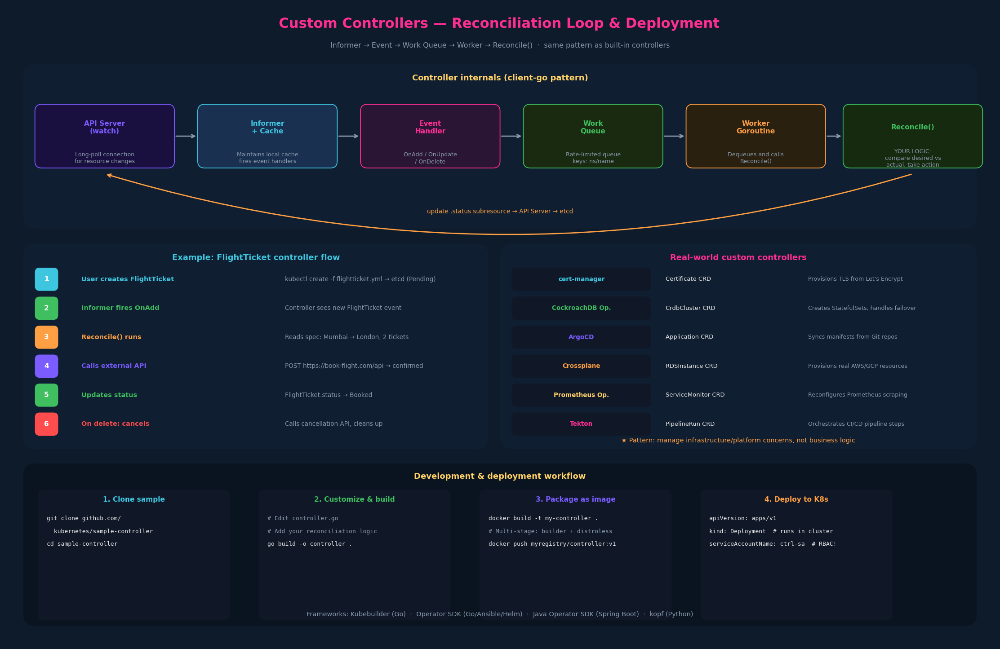

# 13 – Custom Controllers



---

## 1. What a custom controller does

A custom controller is **any process that runs a continuous loop, watches
Kubernetes resources via the API, and takes action to reconcile desired
state with actual state**.

From the previous chapter: a CRD gives you a resource type (schema, storage,
CRUD), but without a controller, those resources just sit in etcd doing
nothing. The controller is what brings them to life.

For the instructor's FlightTicket example:

```
1. User creates FlightTicket resource  →  stored in etcd (status: Pending)
2. Controller watches for FlightTicket events
3. Controller sees new FlightTicket, reads spec (Mumbai → London, 2 tickets)
4. Controller calls external flight booking API (https://book-flight.com/api)
5. API returns booking confirmation
6. Controller updates FlightTicket status → Booked
7. If user deletes FlightTicket → Controller calls cancellation API
```

The controller is the bridge between the declarative Kubernetes model ("I
want 2 tickets Mumbai → London") and the imperative action ("call this HTTP
API to book them").

---

## 2. Your question: what are realistic custom controller use cases?

The flight booking example is intentionally simple but somewhat misleading
because it mixes business logic (booking flights) with infrastructure
management (which is what controllers are typically used for). Here are
real-world examples that make the pattern clearer:

### Platform / infrastructure operators (most common)

| Operator | CRD | What the controller does |
|---|---|---|
| **cert-manager** | `Certificate` | Watches Certificate CRDs, provisions TLS certs from Let's Encrypt or internal CAs, renews before expiry |
| **CockroachDB Operator** | `CrdbCluster` | Creates StatefulSets, Services, PVCs; handles rolling upgrades, backup schedules, failover |
| **PostgreSQL (Zalando)** | `postgresql` | Provisions Postgres clusters with streaming replication, patroni failover, connection pooling |
| **Prometheus Operator** | `ServiceMonitor` | Watches ServiceMonitor CRDs, dynamically reconfigures Prometheus scrape targets |
| **ArgoCD** | `Application` | Watches Application CRDs, syncs Kubernetes manifests from Git repos (GitOps) |
| **Crossplane** | `RDSInstance`, `S3Bucket` | Provisions actual cloud resources (AWS RDS, S3, GCP CloudSQL) from Kubernetes CRDs |
| **Tekton** | `PipelineRun` | Orchestrates CI/CD pipeline steps as Kubernetes pods |
| **Knative** | `Service` (Knative) | Manages serverless workloads with scale-to-zero |

### The pattern in all of these

The controller isn't doing random business logic — it's **managing
infrastructure or platform concerns** through the Kubernetes declarative
model:

1. User declares desired state via a custom resource
2. Controller watches for changes
3. Controller reconciles by creating/updating Kubernetes objects or calling
   external APIs
4. Controller updates the custom resource's `.status` subresource

### Could a company like American Airlines use this?

Probably not for booking flights directly — that's a business transaction
better served by a traditional API service. But they might use a custom
controller for:
- Managing deployment rollouts across regions (CRD: `RegionalDeployment`)
- Provisioning per-team namespaces with quotas (CRD: `TeamEnvironment`)
- Managing database migration state machines (CRD: `SchemaMigration`)

The sweet spot for custom controllers is: **anything where you want
Kubernetes-style declarative management and continuous reconciliation for
infrastructure or platform concerns**.

---

## 3. Anatomy of a custom controller (Go)

The instructor shows the `kubernetes/sample-controller` repository on GitHub
as a starting point. The key structural elements:

```go
// flightticket_controller.go
package flightticket

// Register which resource kind this controller manages
var controllerKind = apps.SchemeGroupVersion.WithKind("Flightticket")

// The reconciliation loop entry point — starts watchers and workers
func (dc *FlightTicketController) Run(workers int, stopCh <-chan struct{}) {
    // Sets up event handlers (informers) that watch etcd for changes
    // Starts worker goroutines that process the work queue
}

// Business logic — called when a FlightTicket is created/updated
func (dc *FlightTicketController) callBookFlightAPI(obj interface{}) {
    // Read the FlightTicket spec
    // Call the external booking API
    // Update the FlightTicket status
}
```

### The controller machinery under the hood

Controllers use the Kubernetes **client-go** library, which provides:

**Informers** — watch the API server for changes to specific resource types.
They maintain a local cache (called the Store) of the current state and fire
event handlers when objects are added, updated, or deleted. This is efficient
because the informer uses HTTP long-polling (watch) rather than repeatedly
polling.

**Work queue** — when an informer fires an event, the controller doesn't
process it immediately. It adds the object's key (namespace/name) to a
rate-limited work queue. Worker goroutines pull items from the queue and
process them. This decouples event detection from event handling and provides
retry logic.

**Reconciliation function** — the actual logic that compares desired state
(what the custom resource says) with actual state (what exists in the real
world) and takes corrective action. This is where your business logic lives.

```
Informer  →  Event Handler  →  Work Queue  →  Worker  →  Reconcile()
  (watch)      (enqueue key)    (rate-limited)  (dequeue)    (your logic)
```

This architecture is identical for built-in and custom controllers — the
DeploymentController uses the same informer/queue/reconcile pattern.

---

## 4. Building and deploying a custom controller

### Step 1 — Start from the sample controller

```bash
# Clone the Kubernetes sample controller
git clone https://github.com/kubernetes/sample-controller.git
cd sample-controller

# Customize controller.go with your logic
# The sample shows the full pattern with informers, work queues, and reconciliation
```

### Step 2 — Build as a Go binary

```bash
# Build the controller
go build -o sample-controller .

# Run locally (for development) — needs kubeconfig access
./sample-controller -kubeconfig=$HOME/.kube/config
```

When you run it, you'll see:
```
I1013 02:11:07.489479  controller.go:115] Setting up event handlers
I1013 02:11:07.489701  controller.go:156] Starting FlightTicket controller
```

### Step 3 — Package as a Docker image

For production deployment, package the controller binary in a container
image:

```dockerfile
FROM golang:1.21 as builder
WORKDIR /app
COPY . .
RUN go build -o controller .

FROM gcr.io/distroless/static
COPY --from=builder /app/controller /controller
ENTRYPOINT ["/controller"]
```

### Step 4 — Deploy to Kubernetes

The controller itself runs as a Deployment in the cluster:

```yaml
apiVersion: apps/v1
kind: Deployment
metadata:
  name: flightticket-controller
  namespace: controllers
spec:
  replicas: 1            # or 2 with leader election for HA
  selector:
    matchLabels:
      app: flightticket-controller
  template:
    spec:
      serviceAccountName: flightticket-controller-sa   # needs RBAC!
      containers:
        - name: controller
          image: myregistry/flightticket-controller:v1
```

The controller's ServiceAccount needs RBAC permissions to watch, get, list,
update, and patch your custom resources (and any Kubernetes resources it
creates). This is the security aspect relevant to CKS.

---

## 5. Controller frameworks (beyond the lecture)

Writing a controller from scratch using client-go is educational but
verbose. In practice, most people use a higher-level framework:

| Framework | Language | Key feature |
|---|---|---|
| **Kubebuilder** | Go | Generates CRD + controller scaffolding, manages RBAC manifests |
| **Operator SDK** | Go, Ansible, Helm | Red Hat's framework; supports multiple implementation languages |
| **kopf** | Python | Lightweight Python framework for controllers |
| **Metacontroller** | Any (webhooks) | Controller-of-controllers; your logic is just webhook endpoints |
| **Java Operator SDK** | Java | Spring Boot integration; relevant to your current skillset |

The **Java Operator SDK** is worth noting for you specifically — it lets you
write Kubernetes operators in Java with Spring Boot integration. The
reconciliation loop, informer machinery, and CRD generation are handled by
the framework. Your logic goes in a `Reconciler<T>` interface implementation.
This could be a stepping stone: write an operator in Java first, then port to
Go once you're comfortable with the patterns.

---

## 6. Exam-pattern gotchas

**Gotcha 1 – Custom controllers are not tested on CKAD**
You won't write Go code or deploy a controller on the exam. The exam tests
your understanding of the CRD side (chapter 12). Know that controllers exist
and complete the picture, but don't spend exam prep time on controller code.

**Gotcha 2 – The controller runs as a regular Deployment**
If an exam question asks "how is a custom controller deployed?" — it's a
Deployment (or StatefulSet) with a ServiceAccount that has RBAC permissions
for the custom resource type.

**Gotcha 3 – Operator = CRD + Controller**
If the exam mentions "operators" — it's the combination of a CRD and a
custom controller packaged together. Know the vocabulary.

---

## 7. JPMC context

Every operator in your stack deploys its controller as a Kubernetes
Deployment with a privileged ServiceAccount:

- **CockroachDB operator**: the controller Deployment watches `CrdbCluster`
  CRDs. When you create a new CockroachDB cluster, the controller creates
  the StatefulSets and Services. The controller's ServiceAccount has
  permissions to create StatefulSets, Services, PVCs, ConfigMaps, and
  Secrets in your SEAL namespace.

- **Calico**: the Calico controller (calico-kube-controllers) runs as a
  Deployment in `calico-system` namespace. It has ClusterRole permissions
  because NetworkPolicy is cluster-affecting.

- **Why you can't see controller logs easily**: the controller Deployments
  typically run in system namespaces (`calico-system`, `projectcontour`,
  operator namespaces) that your SEAL ID RBAC doesn't grant access to. On
  your Hetzner cluster you'll be able to see these directly.

- **The Java Operator SDK path**: when you're ready to build your own
  operator, you could prototype in Java using the Java Operator SDK with
  Spring Boot (familiar territory), then rewrite in Go as a learning
  exercise. This maps directly to your goal of learning Go and eventually
  contributing to Kubernetes.

---

## 8. TL;DR

- A custom controller is a process running a continuous reconciliation loop:
  watch for custom resource changes → take action → update status.
- Built-in controllers (DeploymentController, etc.) use the same pattern;
  all run inside `kube-controller-manager`.
- Custom controllers typically use the client-go library with informers,
  work queues, and a reconciliation function.
- Development workflow: start from `kubernetes/sample-controller`, customize
  `controller.go`, build with `go build`, package as Docker image, deploy as
  a Kubernetes Deployment.
- Real-world use cases are infrastructure/platform management (database
  operators, certificate management, GitOps, cloud resource provisioning) —
  not business logic like booking flights.
- **Operator = CRD + Controller** packaged together.
- Frameworks like Kubebuilder, Operator SDK, and Java Operator SDK reduce
  boilerplate.
- Custom controllers are conceptual on CKAD — the exam tests CRDs, not
  controller code.

---

## Open threads

- [ ] **ServiceAccounts** (dedicated chapter expected): controllers need
  a ServiceAccount with appropriate RBAC. This ties back to the open thread
  from ch07 about ServiceAccounts as subjects.
- [ ] **Go learning path**: the sample-controller repo is an excellent
  real-world Go codebase to study. Informers, work queues, and Go channels
  are idiomatic Go patterns you'll encounter everywhere in the Kubernetes
  codebase.
- [ ] **Java Operator SDK**: prototype in Java first, then port to Go.
  Bridge from current skills to Go learning goal.

## Resolved threads (from ch12)

- [x] **Custom controllers**: the "other half" of the CRD story — fully
  covered. CRD defines the type, controller brings it to life.
