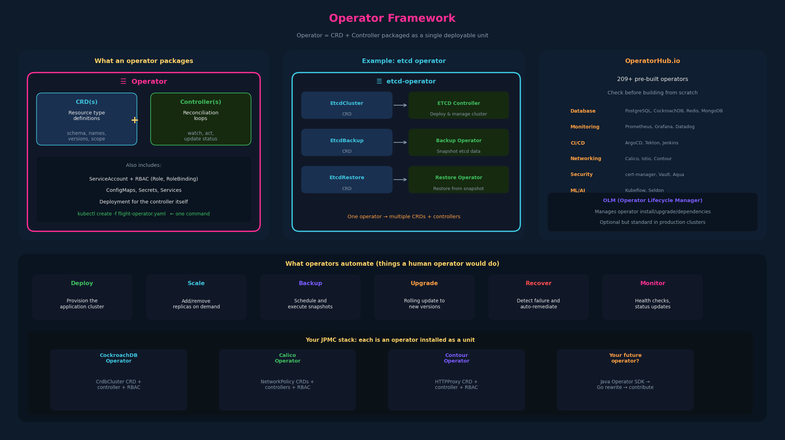

# 14 – Operator Framework



---

## 1. What an operator is

An operator is the **CRD + custom controller packaged as a single
deployable unit**. Instead of creating the CRD and deploying the controller
separately, an operator bundles both so you install the whole thing with
one command:

```bash
kubectl create -f flight-operator.yaml
```

This single manifest (or Helm chart, or OLM bundle) installs:
- The CRD(s) that define the custom resource types
- The controller Deployment that watches those CRDs
- The ServiceAccount, Role, and RoleBinding the controller needs
- Any supporting resources (ConfigMaps, Secrets, Services)

The term "operator" comes from the idea that the controller automates the
tasks a **human operator** would normally do: deploying, scaling, backing
up, upgrading, and recovering an application.

---

## 2. The etcd operator — a concrete example

The instructor highlights the etcd operator as one of the most well-known
operators. It manages an etcd cluster within Kubernetes and defines three
CRDs, each with its own controller:

| CRD | Controller | What it does |
|---|---|---|
| `EtcdCluster` | ETCD Controller | Deploys and manages an etcd cluster (StatefulSet, Services, PVCs) |
| `EtcdBackup` | Backup Operator | Takes snapshots of the etcd database on schedule or on demand |
| `EtcdRestore` | Restore Operator | Restores an etcd cluster from a backup snapshot |

This illustrates an important pattern: **an operator can define multiple
CRDs**, each with its own controller logic. The operator is the umbrella
that packages all of them together.

Without the operator, a human would have to:
- Manually deploy etcd pods with correct configuration
- Set up TLS between etcd members
- Monitor cluster health and replace failed members
- Script periodic backups
- Manually restore from backup during disasters

The operator automates all of this declaratively: you create an
`EtcdCluster` resource and the operator handles the rest.

---

## 3. OperatorHub.io

OperatorHub.io is a community catalog of pre-built operators. At the time
of the lecture it listed 209+ operators across categories:

- **Database**: PostgreSQL, MySQL, MongoDB, CockroachDB, Redis
- **Monitoring**: Prometheus, Grafana, Datadog
- **Integration & Delivery**: ArgoCD, Tekton, Jenkins
- **Networking**: Calico, Istio, Contour
- **Security**: cert-manager, Vault, Aqua
- **AI/Machine Learning**: Kubeflow, Seldon
- **Streaming & Messaging**: Kafka (Strimzi), RabbitMQ

Before building a custom operator from scratch, check OperatorHub — someone
has probably already built one for your use case. The operators listed there
are installable via the Operator Lifecycle Manager (OLM) or directly via
manifests.

---

## 4. Operator Lifecycle Manager (OLM)

OLM is a framework for managing operators in a cluster. It handles:
- Installing operators from a catalog (like OperatorHub)
- Upgrading operators to new versions
- Managing dependencies between operators
- RBAC for operator installation

OLM itself runs as a set of Kubernetes Deployments. It's not required — you
can deploy operators manually with `kubectl apply` — but it standardizes
the install/upgrade lifecycle.

This is deeper CKA/CKS territory. For CKAD, know that OLM exists and that
OperatorHub is the discovery mechanism.

---

## 5. Exam-pattern gotchas

**Gotcha 1 – Operator vocabulary**
If an exam question says "operator," it means CRD + controller. Know
the vocabulary even if you won't build one.

**Gotcha 2 – Operators can define multiple CRDs**
The etcd operator defines three CRDs. An operator isn't limited to one
custom resource type.

**Gotcha 3 – Installing an operator = installing CRDs + controller**
If asked to "install the etcd operator," you'd apply the operator manifest
which creates CRDs, RBAC, and the controller Deployment.

---

## 6. JPMC context

Every operator in your stack was installed as a unit — CRD + controller +
RBAC together:

- The CockroachDB operator was installed by the platform team, which
  created the `CrdbCluster` CRD and the operator Deployment in one step.
  You interact with the CRD; the operator does the rest.

- Calico, Contour — same pattern. Installed as operators. The CRDs
  (NetworkPolicy, HTTPProxy) and controllers came as a package.

- If you ever need an operator that isn't already installed in the cluster,
  you'd request it through the platform org — they control what operators
  run in the cluster via OLM or their own deployment pipeline.

---

## 7. TL;DR

- **Operator = CRD + Controller** packaged together. One install gives you
  the resource types and the automation that acts on them.
- Operators automate the work a human operator would do: deploy, scale,
  backup, upgrade, recover.
- An operator can define **multiple CRDs** (e.g., etcd operator has
  EtcdCluster, EtcdBackup, EtcdRestore).
- **OperatorHub.io** is the community catalog — check it before building
  from scratch.
- **OLM** (Operator Lifecycle Manager) manages operator install/upgrade in
  a cluster. Optional but standard in production.
- CKAD: know the vocabulary. CKA: may install operators. CKS: operator
  RBAC security.

---

## Open threads

- [ ] **Helm** (if covered in course): another packaging mechanism for
  Kubernetes applications. Some operators are installed via Helm charts.
  Different from the operator pattern but complementary.
- [ ] **ServiceAccounts** (still open from ch07): operator controllers need
  ServiceAccounts with specific RBAC — ties directly back to the open thread.

## Resolved threads

- [x] **Operator pattern**: previewed in ch12, controller covered in ch13,
  now fully defined as the CRD + Controller package.
