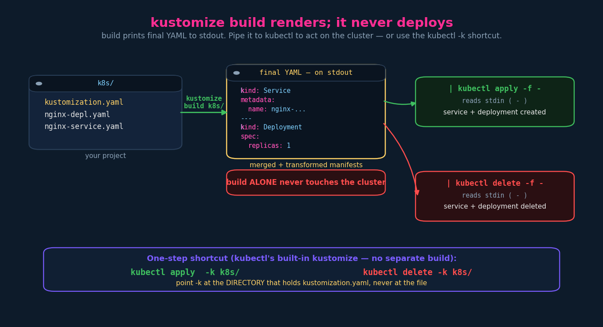

# Install, kustomization.yaml, Build & Output

Three short videos merged: installing the standalone CLI, the anatomy of
`kustomization.yaml`, and how `build` produces output you then apply or delete.
This is the first genuinely hands-on chapter — everything after this is "more
transformers."

---

## 1. Installation (the 60-second version)

**Prereqs:** a running cluster + `kubectl` on your machine. "Cluster up and
running" really means *reachable from this machine* — the control plane and nodes
live wherever they live; you just need kubeconfig access. Kustomize itself is a
client-side binary; it does nothing on the cluster, it only renders YAML locally.

**Install** (Linux/macOS/Windows) — the team ships a script that detects your OS
and grabs the right binary:

```bash
curl -s "https://raw.githubusercontent.com/kubernetes-sigs/kustomize/master/hack/install_kustomize.sh" | bash
```

**Validate:**

```bash
kustomize version
```

Other install paths worth knowing (the script isn't the only way):

```bash
brew install kustomize                 # macOS / Linuxbrew
go install sigs.k8s.io/kustomize/kustomize/v5@latest
# or just download the pinned release binary from the GitHub releases page
```

> Recall from ch.01: `kubectl` already has kustomize **built in** (`kubectl apply
> -k`, `kubectl kustomize`). You only install the standalone CLI to get a
> **newer** version than the one vendored into your `kubectl`. If your tasks only
> use `-k`, you may not need the separate binary at all.

> Depth — don't `curl | bash` in prod. Piping a `master`-branch script straight
> into a shell executes whatever's there today, unpinned and unverified. Fine for
> a lab; in a regulated environment like GKP you'd pull a **version-pinned, checksum-
> verified** binary from an approved internal mirror. Not a CKAD point — a "don't
> build bad habits" point.

---

## 2. The `kustomization.yaml` file

Kustomize looks for a file named **exactly** `kustomization.yaml` (also accepts
`kustomization.yml` or `Kustomization`). **You write it yourself** — it's the
entry point from ch.01, and it does two jobs:

1. **`resources:`** — the list of manifests Kustomize should manage.
2. **customizations / transformers** — what to change across those resources
   (the instructor keeps it to one: a `commonLabels` applied to everything).

```yaml
# k8s/kustomization.yaml
apiVersion: kustomize.config.k8s.io/v1beta1   # optional but good practice (see §6)
kind: Kustomization

# 1) kubernetes resources to be managed by kustomize
resources:
  - nginx-depl.yaml
  - nginx-service.yaml

# 2) customizations that should be applied to all of them
commonLabels:
  company: KodeKloud
```

Folder for that example:

```
k8s/
├── nginx-depl.yaml
├── nginx-service.yaml
└── kustomization.yaml
```

> GKP aside: at work you rarely hand-write this — GKP's **`kickstart`** scaffolds
> a Spring Boot app *with* its kustomize layout for you (think `helm create` /
> `kustomize create`, but JPMC's). Handy, but know what it's generating —
> §7 dissects a real one.

---

## 3. What `commonLabels` actually does (it's more than you think)

One `commonLabels` entry doesn't just add a label to each resource's
`metadata.labels`. It fans **into every label site**: resource labels, **the
Service selector**, **the Deployment `selector.matchLabels`**, *and* the **pod
template labels** — in every managed resource.


That's the mirror image of ch.01's fan-out *problem*: here the fan-out is the
*feature* — declare once, applied everywhere consistently.

> **Gotcha worth more than the lecture gives it:** because `commonLabels` rewrites
> **selectors**, and a Deployment's `spec.selector` is **immutable after
> creation**, applying a new `commonLabels` to an *already-running* Deployment is
> rejected: `field is immutable`. It's painless on first create, painful as a
> retrofit.
>
> **Modern alternative (flag the deprecation drift):** newer kustomize prefers
> the list-form `labels:` transformer, which by default **does not touch
> selectors**:
> ```yaml
> labels:
>   - pairs:
>       company: KodeKloud
>     includeSelectors: false      # default false -> safe on live Deployments
>     includeTemplates: true
> ```
> Mumshad teaches `commonLabels` (still valid, still likely what the exam shows).
> Know it for the cert; reach for `labels:` in real life when you don't want to
> rewrite immutable selectors. (`commonAnnotations` is the annotation-side twin
> and has no selector hazard.)

Other transformers you'll meet immediately (all live in `kustomization.yaml`):

| Field | Effect |
|---|---|
| `namespace: foo` | sets `metadata.namespace` on every resource |
| `namePrefix:` / `nameSuffix:` | prepends/appends to every resource name |
| `commonLabels:` / `commonAnnotations:` | labels/annotations across all (labels also hit selectors) |
| `images:` | rewrite image `name`/`newName`/`newTag`/`digest` |
| `configMapGenerator:` / `secretGenerator:` | generate ConfigMaps/Secrets (with a content-hash name suffix) |

---

## 4. Build & output: render first, deploy second

`kustomize build k8s/` reads the `kustomization.yaml`, **combines** all the listed
manifests, **applies the transformations**, and prints the **final YAML to
stdout**. Critically — and this surprised you because the pipeline hides it —
**`build` does not deploy anything.** It's a pure render.



To actually act on the cluster, **redirect the output into kubectl** — output of
one command becomes input of the next (`-` = read from stdin):

```bash
kustomize build k8s/ | kubectl apply -f -      # render, then create/update
kustomize build k8s/ | kubectl delete -f -     # render, then delete (same pattern)
```

Deleting works exactly the same way — just pipe into `delete` instead of `apply`.

**One-step equivalents** using kubectl's built-in kustomize (no separate
`build`):

```bash
kubectl apply  -k k8s/
kubectl delete -k k8s/
kubectl kustomize k8s/        # = "kustomize build k8s/" via kubectl (render only)
```

> That terminal dump of every rendered YAML you see at the **end of your GKP
> pipeline** is exactly `kustomize build` output — and it's your best debugging
> hook: it's the *final* manifests after all transforms + variable injection, so
> if something's wrong, diff what you intended against what actually rendered
> before it ever hit `apply`.

---

## 5. Imperative / exam shortcuts

```bash
# render & inspect (do this constantly before applying)
kubectl kustomize <dir>            # or: kustomize build <dir>

# apply / delete
kubectl apply  -k <dir>
kubectl delete -k <dir>

# edit kustomization.yaml fast without opening an editor (big exam time-saver)
kustomize edit set image nginx=nginx:1.27
kustomize edit set namespace dev
kustomize edit add resource service.yaml
kustomize edit set replicas nginx-deployment=5

# scaffold a kustomization.yaml from the manifests already in a dir
kustomize create --autodetect --recursive
```

`kustomize edit ...` mutates the `kustomization.yaml` in the current directory in
place — faster and less error-prone than hand-editing under time pressure.

---

## 6. apiVersion & kind

You **can** (and in stricter tooling, should) put a header on the file:

```yaml
apiVersion: kustomize.config.k8s.io/v1beta1
kind: Kustomization
```

It's optional for plain `kustomize build` — kustomize infers it — but it makes the
file self-describing, satisfies schema validators/linters, and is what `kustomize
create` writes for you. Cheap to include; include it.

---

## 7. JPMC / GKP grounding — a real kustomization.yaml dissected

This is the worked GKP example promised back in ch.02. Your actual overlay file:

```yaml
bases:                                   # (1) DEPRECATED field — see note
  - ../../base/

resources:                               # (2) your real service's manifests
  - deployment.yml
  - ingress.yml
  - cert-spec.yml
  - jaas-conf.yml                        # JAAS = Java auth (ties to your Kerberos/ADFS world)
  - cockroach-egress.yml                 # CockroachDB egress NetworkPolicy
  - network-policy.yml                   # Calico default-deny + allows
  - shard-ingress.yml
  - control-plane-ingress.yml            # Contour/Envoy HTTPProxy ingress
  - resource-quota.yml

images:                                  # (3) image transformer
  - name: app-image
    newName: ${containerImageUri}        # <-- NOT kustomize syntax

namespace: ${namespace}                  # (4) namespace transformer + ${} injection

configMapGenerator:                      # (5) generator
  - name: app-runtime-caas-management-plane
    literals:
      - SPRING_PROFILES_ACTIVE=dev
```

What each piece is, and the teaching in it:

1. **`bases:` is deprecated.** It was the old way to point an overlay at its base;
   since kustomize ~v2.1 you fold base paths into `resources:` instead
   (`resources: [ ../../base/, deployment.yml, ... ]`). Your file still works —
   kustomize keeps `bases:` for back-compat — but if you ever rewrite it, move
   `../../base/` up into `resources:`. Worth knowing the field is on borrowed time.

2. **`resources:`** is your service's real stack, and it reads like a tour of your
   notes: CockroachDB egress policy, Calico `network-policy`, Contour/Envoy
   ingress objects, a JAAS auth config, a `resource-quota`. This is the
   base+overlay model from ch.01 doing actual work.

3. **`images:` + `${containerImageUri}` — the hybrid from ch.02, made concrete.**
   The `images:` block is a genuine kustomize transformer (rewrites the image ref
   for the resource named `app-image`). But `${containerImageUri}` is **not
   kustomize** — kustomize has no `${}` variable syntax. That placeholder is
   resolved by **Jules / the pipeline** (technique #3, variable injection) *before
   or around* kustomize runs. So this single file shows both layers stacked:
   kustomize doing the structural transform, Jules supplying the per-build value.

4. **`namespace: ${namespace}`** — same story: `namespace:` is a kustomize
   transformer (stamps the namespace onto every resource), `${namespace}` is a
   Jules-injected value. That's how one overlay serves dev/uat/prod — the pipeline
   feeds a different `${namespace}` and `${containerImageUri}` per environment.

5. **`configMapGenerator:`** builds a ConfigMap from literals
   (`SPRING_PROFILES_ACTIVE=dev` → your Spring Boot profile). Generators append a
   **content-hash suffix** to the generated name (e.g. `...-mgmt-plane-7c9f...`)
   and rewrite references to it, so changing a literal forces a new ConfigMap name
   → triggers a rolling restart. If GKP needs stable names it'll set
   `generatorOptions: { disableNameSuffixHash: true }`. (This is the hash-suffix
   open thread from earlier chapters — now resolved.)

> Net: your GKP overlay = **kustomize transformers** (`images`, `namespace`,
> `configMapGenerator`) + **pipeline variable injection** (`${...}`) over a shared
> **base**. Exactly the three-techniques stack from ch.02 §5, in one file.
>
> If you drop the **`jules.yml`** itself (the key/value side that defines
> `containerImageUri`, `namespace`, etc.), I'll write the full
> `jules.yml → injected → kustomize build → rendered` trace end-to-end — that's
> the one piece this picture is still missing.

> CKAD caveat: `bases:`/`${...}`/`kickstart` are GKP-flavoured. The exam cares
> about `resources:`, `commonLabels`, `namespace:`, `images:`, generators, and
> `build`/`-k`. Everything in §1–§6 is fair game; §7 is for your day job.

---

## TL;DR

- Install: `curl ... install_kustomize.sh | bash`, verify `kustomize version`.
  (kubectl already bundles an older kustomize via `-k`.)
- `kustomization.yaml` (exact name) = `resources:` + transformers; optionally
  headed with `apiVersion: kustomize.config.k8s.io/v1beta1` / `kind: Kustomization`.
- `commonLabels` injects into metadata labels **and selectors and pod templates**
  → great for consistency, but it rewrites **immutable** selectors (use list-form
  `labels:` with `includeSelectors:false` to avoid that on live Deployments).
- `kustomize build <dir>` **renders only**; pipe to `kubectl apply -f -` (or
  `delete -f -`) to act, or use `kubectl apply -k <dir>` / `delete -k <dir>`.
- Your GKP overlay = kustomize transformers + Jules `${}` injection over a base.

## Quick recall

- [ ] Exact filename kustomize looks for? → `kustomization.yaml` (`.yml`/`Kustomization` ok).
- [ ] Two core jobs of the file? → list `resources:` + declare transformations.
- [ ] Does `kustomize build` deploy? → no, it renders to stdout; pipe to kubectl.
- [ ] Render + deploy in one line? → `kustomize build <dir> | kubectl apply -f -`.
- [ ] One-step built-in? → `kubectl apply -k <dir>` / `kubectl delete -k <dir>`.
- [ ] `-k` points at…? → the directory containing `kustomization.yaml`, not the file.
- [ ] Hidden danger of `commonLabels`? → rewrites immutable selectors on live Deployments.
- [ ] Header you can add? → `apiVersion: kustomize.config.k8s.io/v1beta1`, `kind: Kustomization`.
- [ ] Generator name suffix? → content-hash, forces rollout on change (disable via `disableNameSuffixHash`).

## Resolved threads

- *kustomization.yaml syntax* (open since ch.01/02) → `resources:` + transformers, covered.
- *ConfigMap/Secret generator hash-suffix behaviour* → resolved in §7(5).
- *Worked GKP/Jules example* (offered ch.02) → §7, using your real overlay file.

## Open threads (carried into ch.04+)

- [ ] Overlays in depth: how an overlay's `kustomization.yaml` references the base
      and layers patches (the dev/stg/prod structure properly).
- [ ] Patch mechanisms: strategic-merge patch vs JSON6902 patch vs the inline
      `replicas:`/`images:` transformers — when to use which.
- [ ] `namePrefix`/`nameSuffix`, `replacements:` (the modern replacement for the
      old `vars:`).
- [ ] Full `jules.yml → injected → rendered` trace — pending the `jules.yml`.
