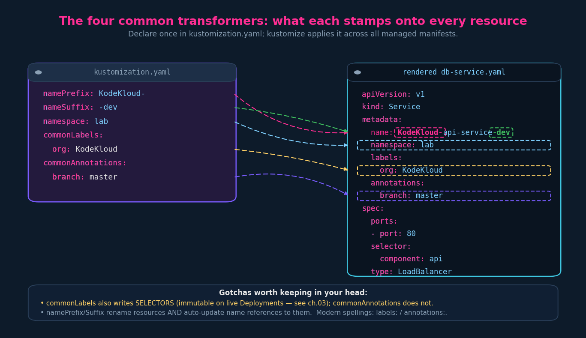
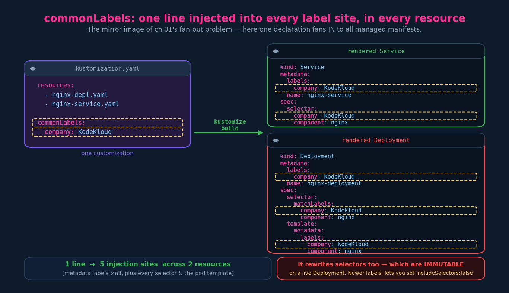

# Transformers (Common + Image)

A **transformer** is how Kustomize changes your configs during `build`. Kustomize
ships several **built-in** transformers and lets you write **custom** ones. Two
built-in families here:

- **Common transformers** — *blanket*: stamp the same thing onto **every**
  resource (`commonLabels`, `commonAnnotations`, `namespace`, `namePrefix`/
  `nameSuffix`).
- **Image transformer** — *targeted*: find a specific image by name and rewrite
  it (`images:`).

> Useful mental model for the rest of the section: transformers run on a
> blanket → targeted → surgical spectrum. Common transformers are **blanket**
> (apply X to all). The image transformer is **targeted** (match this image,
> change it). **Patches** (next chapters) are **surgical** (change this exact
> field in this exact resource). Same `build`, increasing precision.
>
> Field names matter on the exam — memorise the exact spellings.

---

## Part A — Common transformers

### The four

| Field (exact spelling) | What it does | Where it lands |
|---|---|---|
| `commonLabels` | add a label to **all** resources | `metadata.labels` **+ selectors + pod template** |
| `commonAnnotations` | add an annotation to all resources | `metadata.annotations` (only) |
| `namespace` | put all resources in one namespace | `metadata.namespace` |
| `namePrefix` / `nameSuffix` | prepend / append to every resource **name** | `metadata.name` (+ name references) |



> Slide nit: KodeKloud writes "commonLabel" (singular). The real fields are
> **`commonLabels`** and **`commonAnnotations`** (plural) — build fails otherwise.

### Each one, concretely

**`commonLabels`** (recap from ch.03) — adds the label to every resource's
`metadata.labels` **and** into Deployment `selector.matchLabels`, pod
`template.metadata.labels`, and Service `selector`:

```yaml
commonLabels:
  org: KodeKloud
```



> **Hazard:** it rewrites **selectors**, and a Deployment's `spec.selector` is
> **immutable after creation** → adding it to a live Deployment is rejected
> (`field is immutable`). Modern, safer alternative: list-form `labels:` with
> `includeSelectors: false`.

**`commonAnnotations`** — adds to `metadata.annotations` on all resources; does
**not** touch selectors, so no immutability trap. Good for git branch/commit,
owner, ticket, build URL.

```yaml
commonAnnotations:
  branch: master
```

**`namespace`** — stamps `metadata.namespace` onto every **namespaced** resource,
overriding what was there. Cluster-scoped kinds (ClusterRole, PV, `Namespace`)
are left alone; it also fixes some cross-references (e.g. a RoleBinding's
ServiceAccount subject namespace).

```yaml
namespace: lab
```

**`namePrefix` / `nameSuffix`** — wrap every resource name
(`api-service` → `KodeKloud-api-service-dev`). Two surprises: it only changes
`metadata.name` (not labels/selectors, so label wiring still works), and
**Kustomize auto-updates name references** to the renamed resource (Service in an
Ingress backend, `configMapRef`/`secretRef`, etc.). Rename once; pointers follow.

```yaml
namePrefix: KodeKloud-
nameSuffix: -dev
```

---

## Part B — Image transformer

The image transformer changes the **image** a Deployment/container uses, through
Kustomize, without editing the manifest. Declared with `images:`:

```yaml
images:
  - name: nginx          # the EXISTING image to match
    newName: haproxy     # (optional) replace the repo/name
    newTag: "2.4"        # (optional) replace the tag
    # digest: sha256:...  # (optional) pin to a digest instead of a tag
```


How matching works (the part people trip on):

- **`name:` matches the container's image NAME, not the container name.** In a pod
  with `containers: [ - name: web, image: nginx ]`, the matcher is `nginx`, never
  `web`.
- **It rewrites every container** using that image, across all managed resources.
- The three modes (see diagram): `newName` only → `haproxy`; `newTag` only →
  `nginx:2.4`; both → `haproxy:2.4`. `digest:` pins to an immutable `sha256`
  instead of a tag.

Why use this instead of a patch to change an image: it's concise, it's the
intended tool, and it matches by image across the whole bundle in one declaration.

**Imperative (exam gold):**

```bash
kustomize edit set image nginx=haproxy:2.4     # writes the images: block for you
kustomize edit set image nginx=*:2.4           # just the tag
```

---

## Gotchas & depth (both families)

- **`commonLabels` → immutable selectors** — the single most likely Kustomize
  footgun on a live cluster.
- **Plural fields**: `commonLabels`, `commonAnnotations`.
- **Modern spellings**: `labels:`/`annotations:` (list form) give `includeSelectors`
  / `includeTemplates` control; prefer them when you must avoid selectors.
- **`namespace`** is ignored on cluster-scoped kinds (no error).
- **Affixes hit generated names** too: a `configMapGenerator` output can become
  `KodeKloud-app-config-dev-7c9f...` (prefix/suffix **and** content-hash).
- **Image transformer matches the image name** value, and only rewrites image
  references — it won't touch labels/selectors.

---

## Imperative / exam shortcuts

```bash
kustomize edit set namespace lab
kustomize edit set nameprefix KodeKloud-
kustomize edit set namesuffix -dev
kustomize edit set label org:KodeKloud
kustomize edit set annotation branch:master
kustomize edit set image nginx=haproxy:2.4
kubectl kustomize .            # render and verify the transforms landed
```

Always render (`kubectl kustomize <dir>`) and eyeball the output before applying.

---

## JPMC / GKP grounding — the image transformer is the one you live in

The dev overlay from ch.03/04 carries this block, and it's a textbook image
transformer fused with pipeline injection:

```yaml
images:
  - name: app-image                 # placeholder image name used in the base
    newName: ${containerImageUri}    # real registry URI, injected by Jules
```

The pattern, and why it's good practice:

- The **base** Deployment references a **placeholder image name** (`app-image`),
  *not* a hardcoded registry path or tag. The base stays environment- and
  build-agnostic.
- The overlay's **image transformer** matches `app-image` and rewrites it to the
  real image via `newName: ${containerImageUri}`.
- **`${containerImageUri}` is not Kustomize** — it's resolved by **Jules**
  (your CI/CD config) at pipeline time, supplying the actual registry path + tag/
  digest for *this* build. (Image transformer = technique #1; `${...}` injection =
  technique #3, from ch.02 §5.)
- Net effect: promoting across dev → uat → prod is the **same base** with a
  **different injected URI** — CI owns the image, the manifests never hardcode it.

> This is also where **`kickstart`** comes in: it's JPMC's web scaffolder — pick
> an app type (e.g. a **Moneta** app, JPMC's Spring Boot extension layer) and a
> platform (**GKP**), and it generates the repo, the base, and the per-env
> overlays (including exactly this `images:`/`namespace:`/`configMapGenerator`
> wiring). That's why your overlay looked "already done" — kickstart wrote it.
> The course covers the overlay structure it generates later in this section.

The two common transformers that matter operationally in your SEAL-ID /
namespace-scoped RBAC world: **`namespace`** must resolve to your project's real
namespace (RBAC is namespace-scoped, AD-group RoleBindings are tied to it — a
wrong `${namespace}` lands resources where you have no permissions), and
**`commonLabels`/`commonAnnotations`** are the home for org/SEAL-ID/cost-centre
metadata that platform + FinOps tooling key off.

> CKAD scope: field names and what each transforms are fair game (incl. `images:`
> with `newName`/`newTag`). The `${...}`/kickstart/Moneta specifics are GKP flavour.

---

## TL;DR

- Transformers change configs at `build`; spectrum is **blanket** (common) →
  **targeted** (image) → **surgical** (patches, next).
- Common: `commonLabels` (labels **+ selectors + template** — immutable-selector
  hazard), `commonAnnotations` (annotations only, safe), `namespace`,
  `namePrefix`/`nameSuffix` (wrap names, **auto-update references**).
- Image: `images: { name, newName, newTag, digest }` — matches the **image name**
  (not container name), rewrites it everywhere; `kustomize edit set image …`.
- Your GKP overlay's `images: name: app-image / newName: ${containerImageUri}` is
  the image transformer + Jules injection — base uses a placeholder image, CI sets
  the real one per build/env.

## Quick recall

- [ ] Four common transformers? → `commonLabels`, `commonAnnotations`, `namespace`, `namePrefix`/`nameSuffix`.
- [ ] Which rewrites selectors (risky on live Deployments)? → `commonLabels`.
- [ ] Safe metadata one? → `commonAnnotations`.
- [ ] Does `namePrefix` change labels/selectors? → no, only `metadata.name` (+ references).
- [ ] Image transformer field? → `images:` with `name` (match) + `newName`/`newTag`/`digest`.
- [ ] Does `images.name` match the container name? → no, the **image** name.
- [ ] Imperative image change? → `kustomize edit set image nginx=haproxy:2.4`.
- [ ] GKP image pattern? → base placeholder `app-image` → `newName: ${containerImageUri}` (Jules-injected).

## Resolved threads

- *commonLabels behaviour* — covered across ch.03 + here.
- *Image transformer (`images:` with `newName`/`newTag`/`digest`)* — covered (was an open thread).

## Open threads (carried into ch.06+)

- [ ] **Patches** (grouped, multiple lectures): strategic-merge patch vs JSON6902
      patch — modifying *specific* fields surgically.
- [ ] `replacements:` (modern replacement for the old `vars:`).
- [ ] Full `jules.yml → injected → kustomize build → rendered` trace — pending the `jules.yml`
      (we now have both the `images:` and `namespace:` injection points mapped).
