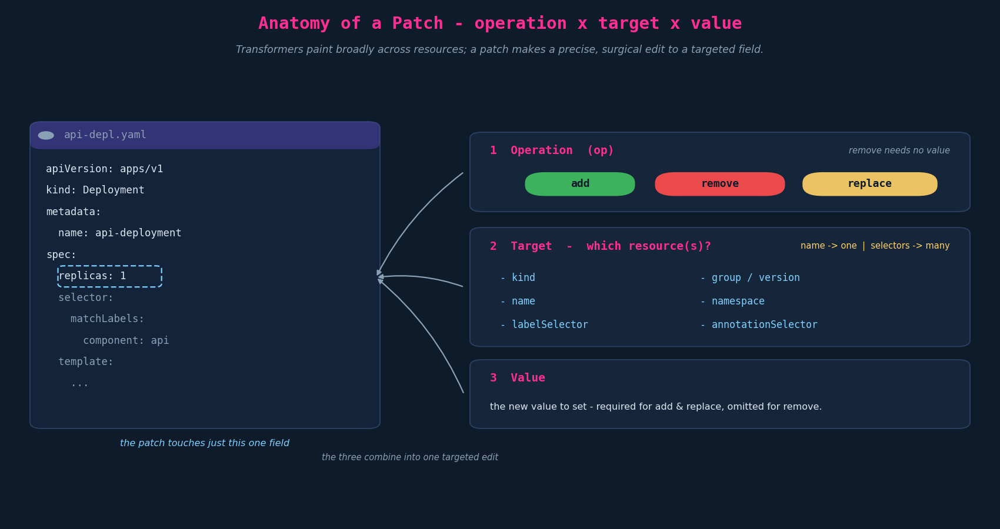
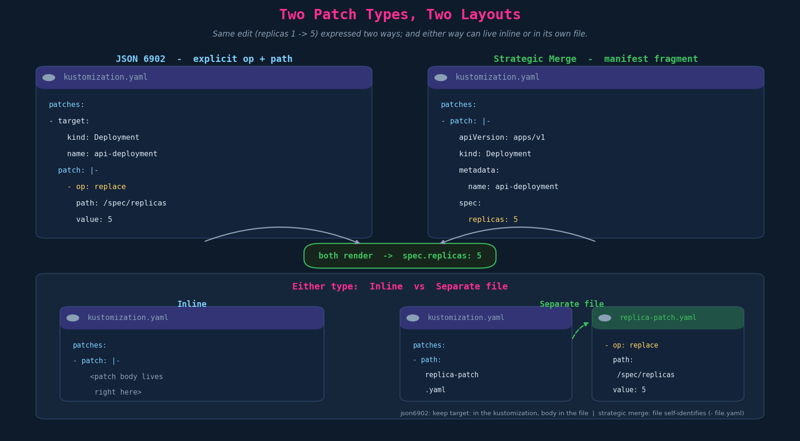

# Patches — Introduction, Types & Layout

> **Context.** Transformers (Ch05: `commonLabels`, `namespace`, `namePrefix`, `images:` …)
> are broad-brush — one rule rewrites a whole class of fields across every resource. A
> **patch** is the opposite: a *surgical* edit aimed at one or more **specific** sections of a
> targeted resource. This chapter is the patches **intro** — what a patch is, the three
> parameters that define one, the **two patch types** (JSON6902 vs strategic merge), and the
> **two layouts** (inline vs separate file). The per-operation mechanics live in the next two
> chapters: **Ch07 (dictionaries)** and **Ch08 (lists)**.

---

## 1. What a patch is, and its three parameters

A patch answers three questions. The course frames them as the three required parameters:



1. **Operation** (`op`) — `add`, `remove`, or `replace`.
2. **Target** — *which* resource(s) the patch hits. Selectable by: `kind`, `group` /
   `version`, `name`, `namespace`, `labelSelector`, `annotationSelector`.
3. **Value** — the new value to set. **Required for `add` and `replace`; omitted for `remove`.**

Two things worth pinning down beyond the slide:

- **`name` targets one resource; `labelSelector`/`annotationSelector` can fan out to many.**
  A single patch with `labelSelector: tier=backend` applies to every matching resource — patches
  aren't strictly one-resource.
- **The "operation / target / value" triad is really the *JSON6902* mental model.** Strategic
  merge (below) has no explicit `op` and no `path`; the "operation" is *implicit in the shape*
  of the fragment and the target is *embedded* via `apiVersion`/`kind`/`metadata.name`. So treat
  the three-parameter framing as the JSON6902 view, not a universal one.

### 1.1 Two worked examples (both JSON6902)

Rename a Deployment (replace a dictionary value — see Ch07):

```yaml
patches:
  - target: { kind: Deployment, name: api-deployment }
    patch: |-
      - op: replace
        path: /metadata/name
        value: web-deployment        # api-deployment -> web-deployment
```

Scale it (replace a scalar):

```yaml
patches:
  - target: { kind: Deployment, name: api-deployment }
    patch: |-
      - op: replace
        path: /spec/replicas
        value: 5                      # replicas 1 -> 5
```

Both use `replace`, which **requires the path to already exist** — fine here, since
`metadata.name` and `spec.replicas` are present in the base.

---

## 2. Two patch types: JSON 6902 vs strategic merge

The same edit can be written two ways. They differ in *form*, not in result.



```yaml
# JSON 6902 — explicit op + JSON-Pointer path  (RFC 6902)
patches:
  - target: { kind: Deployment, name: api-deployment }
    patch: |-
      - op: replace
        path: /spec/replicas
        value: 5
```

```yaml
# Strategic merge — a fragment shaped like the manifest
patches:
  - patch: |-
      apiVersion: apps/v1
      kind: Deployment
      metadata:
        name: api-deployment
      spec:
        replicas: 5
```

| | **JSON 6902** | **Strategic merge** |
|---|---|---|
| Form | explicit `op` + `path` + `value` | a partial copy of the manifest |
| Targeting | `target:` selector in the kustomization | identifying fields inside the patch (`kind`,`metadata.name`) |
| Schema | none needed — purely structural; works on CRDs | uses the type's schema / merge metadata |
| Reads like | a surgical instruction | "here's the bit that's different" |
| Reference | RFC 6902 (`datatracker.ietf.org/doc/html/rfc6902`) | Kubernetes strategic-merge semantics |

Rule of thumb: **strategic merge** when the edit reads naturally as "a slice of the manifest";
**JSON6902** when you need a precise op, an awkward path, or you're patching a CRD/field with no
strategic-merge schema. (The add/replace/remove details — and where the two genuinely diverge,
on **lists** — are Ch07/Ch08.)

---

## 3. Inline vs separate file

Orthogonal to the type: the patch **body** can sit inline in the kustomization, or live in its
own file. Identical output — purely organisation.

```yaml
# Inline (JSON6902 shown; strategic merge inlines the same way under patch: |-)
patches:
  - target: { kind: Deployment, name: api-deployment }
    patch: |-
      - op: replace
        path: /spec/replicas
        value: 5
```

```yaml
# Separate file
patches:
  - path: replica-patch.yaml          # JSON6902: target: stays in the kustomization…
    target: { kind: Deployment, name: nginx-deployment }
# replica-patch.yaml:
#   - op: replace
#     path: /spec/replicas
#     value: 5
```

For a **strategic-merge** separate file the file self-identifies (it carries
`apiVersion`/`kind`/`metadata.name`), so it can be referenced with just `- path: replica-patch.yaml`
(or the bare `- replica-patch.yaml` shorthand) and no `target:` is needed.

Rule of thumb: inline for a line or two; separate file once it grows or wants to be reviewed/reused
on its own.

---

## 4. The unified `patches:` field (and the legacy split)

Everything above uses the single **`patches:`** field; kustomize auto-detects the type from the
body shape (an `op:`/`path:` list → JSON6902; manifest fields → strategic merge).

> **Precision flag (deprecated fields).** Older repos use the *split* fields
> **`patchesStrategicMerge:`** and **`patchesJson6902:`**. They still work but are **superseded by
> `patches:`** — prefer `patches:` in anything new. You'll meet the legacy fields in existing code,
> so recognise them.

---

## 5. Exam-pattern gotchas

- **`value` is required for `add`/`replace`, forbidden-in-spirit for `remove`.** Don't tack a value
  onto a remove.
- **`replace` needs the path to exist.** If unsure whether a key/field is present, `add` is the
  create-or-overwrite-safe choice (Ch07).
- **JSON6902 needs a `target:`; strategic merge self-identifies.** A JSON6902 patch with no target
  has nothing to attach to; a strategic-merge fragment missing `metadata.name` can't be matched.
- **Type is auto-detected by shape.** Putting `op:`/`path:` lines inside a manifest-shaped fragment
  (or vice-versa) confuses kustomize — keep the body consistent with one type.
- **Patch vs transformer.** A `labels:`/`commonLabels` transformer rewrites labels *and selectors*
  across resources; a patch edits exactly what you target. Choose the surgical tool for surgical work.

---

## 6. Imperative / `kustomize edit` shortcuts

```bash
# register a patch entry (file form), scoped to a target
kustomize edit add patch \
  --path replica-patch.yaml \
  --group apps --version v1 --kind Deployment --name api-deployment

# preview the merged result before applying
kubectl kustomize overlays/dev        # or: kustomize build overlays/dev
```

You hand-write the patch body; what's scriptable is registering it and verifying the render.

---

## 7. JPMC / GKP grounding

Patches are the overlay's surgical layer on a Kickstart-scaffolded base (Moneta Spring Boot app on
GKP). The base is generated; the overlay then patches in the per-env / per-policy deltas a
transformer can't express:

- **`replicas`** per environment (dev 1 → prod N) is the canonical strategic-merge one-liner — and
  it shows up in a PR as exactly `replicas: 2 → 3`, which matters for change control / audit.
- **Surgical field edits** (a single annotation, a `securityContext`, an `args` flag) ride on
  patches; broad rewrites (`images:`, `namespace:`) stay with transformers.
- **Separate-file patches** are the reviewable form the team prefers once a patch is more than a
  line; trivial edits stay inline.
- **Ordering with Jules:** `${variable}` substitution runs **before** Kustomize, so a patch `value:`
  can be `${namespace}` / `${containerImageUri}` and arrive resolved — the "three techniques" hybrid
  (Ch02), now at the patch layer.

---

## TL;DR

- A **patch** is a surgical edit to targeted resource(s); a transformer is a broad rewrite.
- Three parameters (JSON6902 framing): **operation** (`add`/`remove`/`replace`), **target**
  (`kind`/`group`-`version`/`name`/`namespace`/`labelSelector`/`annotationSelector`), **value**
  (add & replace only).
- Two **types**: **JSON6902** (explicit `op`+`path`+`value`, schema-free) and **strategic merge**
  (a manifest fragment). Same result; pick by readability / CRD support.
- Two **layouts**: **inline** under `patch: |-`, or a **separate file** (`path:`); orthogonal to type.
- All under the unified **`patches:`** field (legacy `patchesStrategicMerge:`/`patchesJson6902:` are
  superseded).

## Quick recall

- [ ] Patch vs transformer? → patch = surgical/targeted; transformer = broad rewrite.
- [ ] Three patch parameters? → operation, target, value.
- [ ] When is `value` omitted? → on `remove`.
- [ ] Two patch types? → JSON6902 (op/path/value) and strategic merge (manifest fragment).
- [ ] How does each find its target? → JSON6902 via `target:`; strategic merge via `metadata.name` in the fragment.
- [ ] How does kustomize tell the two apart? → by the body's shape (auto-detect).
- [ ] Inline vs separate file — does it change output? → No, organisation only.
- [ ] Unified field vs legacy? → `patches:` (modern); `patchesStrategicMerge:`/`patchesJson6902:` (legacy).
- [ ] Does `replace` work on a missing path? → No — it must already exist.

## Resolved threads

- *(From Ch02 open thread) Patch mechanisms — strategic-merge vs JSON6902?* → Two equivalent ways to
  express a patch; JSON6902 is explicit-op/structural, strategic merge is manifest-shaped. Detailed
  per-operation behaviour is Ch07/Ch08.
- *Why did the "3 parameters" framing feel JSON6902-shaped?* → Because it is; strategic merge has no
  explicit op/path.

## Open threads

- [ ] **Ch07 — dictionaries:** add/replace/remove on map fields; strategic-merge `null` deletion;
      JSON-Pointer `~1`/`~0` escaping. *(already written)*
- [ ] **Ch08 — lists:** positional JSON6902 (`/0`, `/-`) vs keyed strategic merge; `$patch: delete`;
      scalar-list replace caveat. *(already written)*
- [ ] **Overlays** — the section's closing lectures (per course order): how overlays reference a base,
      compose deltas, and the end-to-end base→overlay build. → next chapter (Ch09).
- [ ] **`jules.yml` end-to-end trace** still owed: `jules.yml → ${variable} injection → kustomize
      build → rendered manifest` (`${containerImageUri}`, `${namespace}`), pending the file share.
