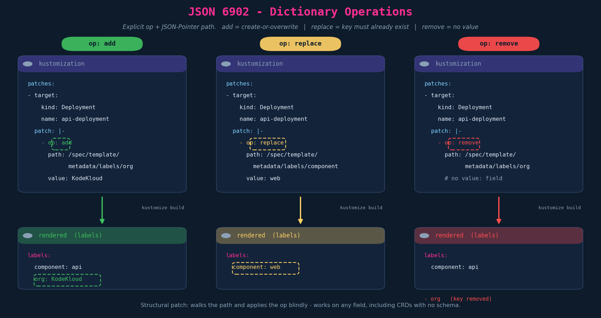
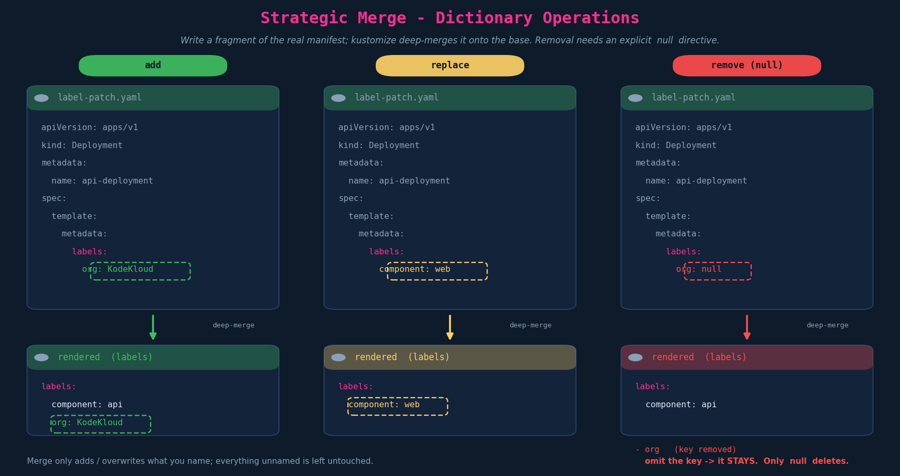
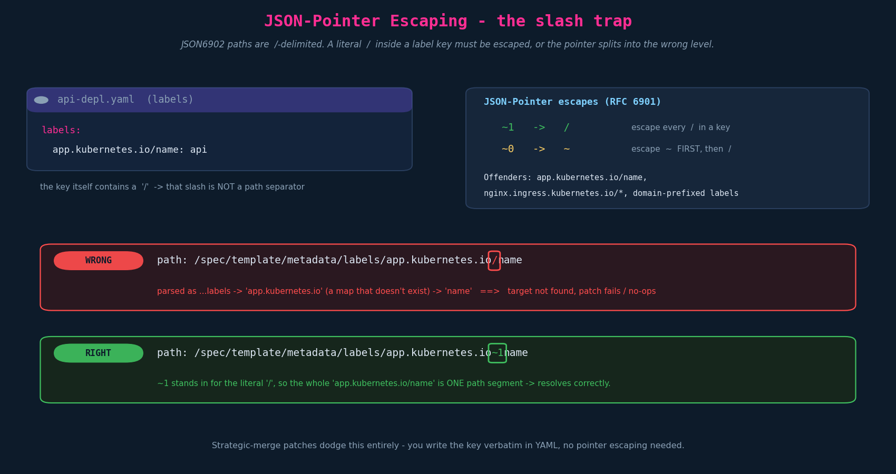

# Patches — Dictionaries (add / replace / remove)

> **Context.** Ch06 introduced *patches* as the surgical alternative to transformers:
> a transformer (`commonLabels`, `namePrefix`, `images:` …) rewrites a whole class of
> fields across all resources; a **patch** edits **one field on one targeted resource**.
> Ch06 also split patches into the two flavours — **JSON 6902** (explicit `op`/`path`)
> and **strategic merge** (a fragment of the real manifest) — and the two layouts
> (**inline** `patch: |-` vs **separate file** `path: patch.yaml`).
>
> This chapter drills into operating on a **dictionary** (a map field such as
> `metadata.labels`): the three operations **add / replace / remove**, done both ways.
> **Lists are deliberately a separate chapter (Ch08)** — there are enough dictionary
> slides to stand alone, and lists have their own quirks (positional `-` vs index,
> and `$patch: delete`).

---

## 1. The mental model: same outcome, two engines

A patch always answers two questions: **which resource** and **what change**. The two
flavours differ in *how you express the change*.

| | **JSON 6902** | **Strategic merge** |
|---|---|---|
| Shape | explicit op list: `op` + `path` + `value` | a partial copy of the manifest |
| Targeting | `target:` selector (kind/name/…) in the kustomization | identifying fields (`apiVersion`,`kind`,`metadata.name`) **inside the patch** |
| Reads like | a surgical instruction | "here's the bit that's different" |
| Needs a schema? | **No** — purely structural, works on any field / CRD | **Yes-ish** — uses the type's patch metadata; CRDs without a schema fall back to JSON-merge semantics |
| Deletes by | `op: remove` | setting the key to **`null`** |

Both are listed under the **unified `patches:` field**. Kustomize decides which engine to
use: a list item with a `patch:` string containing `op:`/`path:` is JSON6902; a list item
pointing at (or inlining) a manifest fragment is strategic merge.

> **Precision flag (deprecated fields).** Older repos use the *split* fields
> `patchesJson6902:` and `patchesStrategicMerge:`. These still work but are **superseded
> by the single `patches:` field** — prefer `patches:` in anything new. The lecture's
> screenshots already use the modern `patches:` form.

---

## 2. JSON 6902 — dictionary ops

JSON6902 (RFC 6902, "JSON Patch") is a list of operations. Each op names a `path`
(an RFC 6901 **JSON Pointer**, `/`-delimited) and, for add/replace, a `value`.



```yaml
# kustomization.yaml
patches:
  - target:
      kind: Deployment
      name: api-deployment
    patch: |-
      - op: add                                    # create-or-overwrite
        path: /spec/template/metadata/labels/org
        value: KodeKloud
      - op: replace                                # key MUST already exist
        path: /spec/template/metadata/labels/component
        value: web
      - op: remove                                 # no value: field
        path: /spec/template/metadata/labels/org
```

Operation semantics — the part the lecture glosses over:

| op | key missing | key present | needs `value:` |
|---|---|---|---|
| `add` | creates it | **overwrites** it | yes |
| `replace` | **errors** | overwrites it | yes |
| `remove` | **errors** | deletes it | no |

So `add` is the safe choice when you're unsure whether the key exists; `replace` is the
stricter, more self-documenting choice when you *expect* it to be there and want a loud
failure if your assumption is wrong.

---

## 3. Strategic merge — dictionary ops

Strategic merge is "**describe the delta in the shape of the manifest**." You write a
fragment that mirrors the path down to the field, and kustomize **deep-merges** it onto
the base. The fragment carries `apiVersion`/`kind`/`metadata.name` so kustomize knows
*which* resource to merge into.



```yaml
# label-patch.yaml  (referenced by  patches: [ - path: label-patch.yaml ]  or inline)
apiVersion: apps/v1
kind: Deployment
metadata:
  name: api-deployment
spec:
  template:
    metadata:
      labels:
        org: KodeKloud      # add: name a new key
        component: web      # replace: name an existing key with a new value
        # org: null         # remove: the ONLY way to delete with strategic merge
```

### 3.1 Why deletion needs an explicit `null`

This is the subtle bit. A merge **only ever adds or overwrites the keys you name** —
everything you *don't* mention is left exactly as it was. That's the whole point of a
merge: it's additive by default. So the engine has **no way to infer "delete"** from a
key simply being absent from your fragment — absence means "leave it alone," not "remove
it."

To delete, you have to give an **explicit directive**. For a dictionary key, that
directive is **`key: null`**. (For *lists*, the equivalent directive is `$patch: delete`
— that's a Ch08 problem.)

> **Gotcha, stated plainly:** omitting a key in a strategic-merge patch does **not**
> remove it. Only `key: null` does.

---

## 4. JSON-Pointer escaping — the slash trap

A JSON6902 `path` is `/`-delimited, so a **literal `/` inside a key name** (extremely
common in Kubernetes label/annotation keys) collides with the delimiter and must be
escaped. This is almost never shown in intro courses and it *will* waste an afternoon
the first time it bites you.



RFC 6901 escapes (apply in this order):

| In the key | Write in the path |
|---|---|
| `~` | `~0`  *(do this first)* |
| `/` | `~1` |

```yaml
# Target label:  app.kubernetes.io/name: api
patch: |-
  - op: replace
    path: /spec/template/metadata/labels/app.kubernetes.io~1name   # ~1 == '/'
    value: web
```

Skip the escape and the pointer reads `…/labels/app.kubernetes.io/name` as *two* levels —
a `name` key under a non-existent `app.kubernetes.io` map — and the patch fails or
silently no-ops. **Strategic merge sidesteps this entirely**: you write the key verbatim
in YAML, no pointer involved.

---

## 5. Inline vs separate file (recap)

Either flavour can live **inline** in the kustomization or in its **own file** — purely a
layout choice, identical output.

```yaml
patches:
  # inline strategic merge
  - patch: |-
      apiVersion: apps/v1
      kind: Deployment
      metadata: { name: api-deployment }
      spec: { template: { metadata: { labels: { org: KodeKloud } } } }

  # separate-file strategic merge
  - path: label-patch.yaml

  # inline JSON6902 (note the target: selector)
  - target: { kind: Deployment, name: api-deployment }
    patch: |-
      - op: add
        path: /spec/template/metadata/labels/org
        value: KodeKloud
```

Rule of thumb: inline for one or two trivial edits, separate file once the patch is more
than a few lines or is reused/reviewed on its own.

---

## 6. Exam-pattern gotchas

- **Strategic-merge delete = `null`.** Omitting the key does nothing. If a task says
  "remove label X with a strategic-merge patch," the answer is `X: null`.
- **`replace` errors on a missing key; `add` is create-or-overwrite.** If you're not
  sure the key exists, reach for `add`.
- **`remove` takes no `value:`.** Including one isn't always rejected but it's wrong;
  don't muscle-memory a value onto a remove.
- **Escape `/` in keys as `~1`** (and `~` as `~0`, first) inside JSON6902 paths. This is
  the single most common JSON6902 mistake with real-world labels/annotations.
- **JSON6902 needs `target:`; strategic merge self-identifies.** A JSON6902 patch with no
  `target:` has nothing to attach to. A strategic-merge fragment missing `metadata.name`
  can't be matched.
- **Patch vs transformer for labels:** a `labels:`/`commonLabels` transformer rewrites
  labels *and selectors* across resources; a dictionary patch on `metadata.labels`
  touches **only that one label on that one resource** and leaves selectors alone. Pick
  the surgical tool when the task is surgical.
- **CRDs / arbitrary fields → prefer JSON6902.** Strategic merge depends on the type's
  schema; for a CRD without one it degrades to plain JSON-merge behaviour, which can
  surprise you on lists. JSON6902 is schema-agnostic.

---

## 7. Imperative / `kustomize edit` shortcuts

There's no fast imperative way to *compose* a patch body — you'll hand-write the YAML.
What you can script is **registering** a patch file in the kustomization:

```bash
# add a strategic-merge / json6902 patch entry, scoped to a target
kustomize edit add patch \
  --path label-patch.yaml \
  --group apps --version v1 --kind Deployment --name api-deployment

# preview the merged result before applying (exam-safe verification)
kubectl kustomize overlays/dev          # or:  kustomize build overlays/dev
```

Always `kubectl kustomize <dir>` to **confirm the field actually changed** in the rendered
output before `kubectl apply -k`. On the exam this catches a wrong path or a forgotten
`~1` immediately.

---

## 8. JPMC / GKP grounding

Patches are how org-policy edits get layered onto a **Kickstart**-scaffolded base without
forking it. The base is generated for you (Moneta Spring Boot app type, GKP platform); the
overlay then patches in environment- or policy-specific deltas:

- **Strategic-merge patches** to inject a `securityContext`, resource `limits`, or a
  `priorityClassName` onto the base Deployment — readable, diffable, and they show up in a
  PR as exactly the lines that changed (matters for change control / audit on a regulated
  platform).
- **JSON6902** when the edit is surgical or the field is awkward — e.g. flipping a single
  `app.kubernetes.io/...` label (remember `~1`), where strategic merge would be overkill.
- **Ordering with Jules:** `${variable}` substitution happens **before** Kustomize runs,
  so a patch `value:` can itself be `${namespace}` or `${containerImageUri}` and arrive
  already-resolved at build time. This is the same "three techniques" hybrid established in
  Ch02 — structural overlay + pipeline injection — now applied at the *patch* layer.

The practical division of labour on the team: **transformers** for the broad strokes
(`images:`, `namespace:`), **patches** for the one-off field edits a transformer can't
express cleanly.

---

## TL;DR

- A **patch** edits one field on one targeted resource; this chapter = **dictionary**
  (map) fields, three ops: **add / replace / remove**.
- **JSON6902** = explicit `op` + JSON-Pointer `path` (+ `value`), targeted via `target:`.
  `add` = create-or-overwrite, `replace` = must-exist, `remove` = no value.
- **Strategic merge** = a manifest fragment that's deep-merged; self-identifies via
  `metadata.name`. Add/replace by naming the key; **delete only via `key: null`**.
- Merge is additive — it **can't infer deletion from omission**, hence the explicit
  `null` directive.
- JSON6902 paths are `/`-delimited: escape `/` in keys as **`~1`** (and `~` as `~0`).
- Both flavours run under the unified **`patches:`** field; both can be inline or in a
  file. JSON6902 wins for CRDs/arbitrary fields; strategic merge reads more naturally.

## Quick recall

- [ ] Two patch flavours? → JSON6902 (op/path/value) and strategic merge (manifest fragment).
- [ ] How does each pick its target? → JSON6902 via `target:`; strategic merge via `metadata.name` in the fragment.
- [ ] `add` vs `replace` when the key is missing? → `add` creates it; `replace` errors.
- [ ] Does `remove` take a `value:`? → No.
- [ ] Delete a dict key with strategic merge? → `key: null` (omission does nothing).
- [ ] Why is `null` required? → merge is additive; it can't infer deletion from absence.
- [ ] Patch a label whose key is `app.kubernetes.io/name` via JSON6902 — the path? → `…/labels/app.kubernetes.io~1name`.
- [ ] One field for both flavours? → `patches:` (legacy `patchesJson6902:`/`patchesStrategicMerge:` are superseded).
- [ ] Verify before applying? → `kubectl kustomize <dir>`.

## Resolved threads

- *Why can't strategic merge just delete a key I leave out?* → Because a merge only
  adds/overwrites named keys; unnamed keys are preserved by design. Deletion needs an
  explicit directive (`null` for dicts).
- *When JSON6902 vs strategic merge for a dictionary?* → Schema-less/CRD/awkward-field →
  JSON6902; readable everyday Deployment edits → strategic merge.

## Open threads (→ Ch08: Patches — Lists)

- [ ] **List add (JSON6902):** a leading `-` appends to the **end** of the list; supplying
      an **index** in the path inserts at a chosen position.
- [ ] **List delete (strategic merge):** requires the explicit **`$patch: delete`**
      directive (the list-level analogue of `key: null`) — same reason: merge can't infer
      removal.
- [ ] Strategic-merge list **merge keys** (how k8s decides "same element" when merging
      lists of maps, e.g. containers by `name`).
- [ ] `replacements:` (the modern successor to `vars:`) — copy a value from one field to
      another — likely the next lecture after lists.
- [ ] **`jules.yml` end-to-end trace** still owed: `jules.yml → ${variable} injection →
      kustomize build → rendered manifest` (`${containerImageUri}`, `${namespace}`),
      pending the file share.
