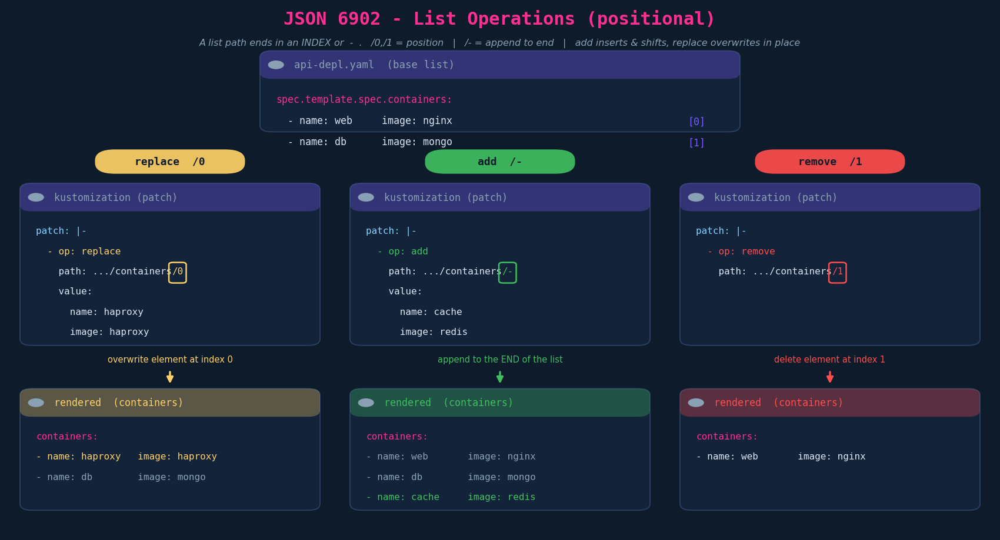
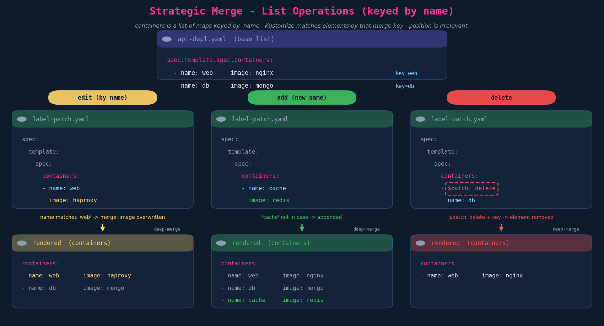
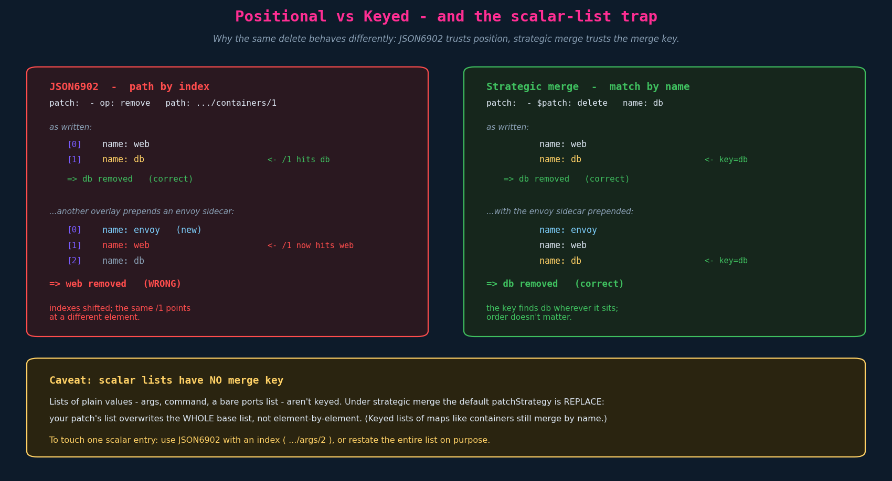

# Patches — Lists (replace / add / delete)

> **Context.** Ch07 patched **dictionaries** (map fields like `metadata.labels`). Lists —
> `spec.template.spec.containers`, `volumes`, `env`, `args` — behave differently enough to
> warrant their own chapter. The split that mattered for dicts (JSON6902 vs strategic
> merge) returns here, but the *defining* difference is **how each engine identifies the
> element you mean**:
>
> - **JSON6902 is positional** — the path ends in an **index** (`/0`, `/1`) or `-`.
> - **Strategic merge is keyed** — it matches list-of-map elements by a **merge key**
>   (for `containers`, that key is `name`).
>
> That single distinction drives every behaviour and every gotcha below.

---

## 1. JSON 6902 — lists are positional

The path's final segment is a **position**, not a name:

| Final path segment | Meaning |
|---|---|
| `/0`, `/1`, … | element at that index |
| `/-` | the (virtual) slot **after the last** element → **append** |



```yaml
patches:
  - target: { kind: Deployment, name: api-deployment }
    patch: |-
      # replace the WHOLE element at index 0
      - op: replace
        path: /spec/template/spec/containers/0
        value:
          name: haproxy
          image: haproxy

      # append a new element to the end
      - op: add
        path: /spec/template/spec/containers/-
        value:
          name: cache
          image: redis

      # delete the element at index 1
      - op: remove
        path: /spec/template/spec/containers/1
```

Three things the lecture doesn't spell out:

- **`add` vs `replace` on a list are not the same.** `add /containers/0` **inserts before**
  index 0 and shifts everything down; `replace /containers/0` **overwrites in place**.
  `add /containers/-` is the append form.
- **`replace` on an index swaps the entire element.** To change just one field, point the
  path *into* the element: `path: /spec/template/spec/containers/0/image`, `value: haproxy`.
- **`remove` takes no `value:`** and deletes whatever currently sits at that index.

---

## 2. Strategic merge — lists are keyed

Strategic merge doesn't count positions. It knows `containers` is a **list of maps keyed by
`name`** (the schema marks it `x-kubernetes-patch-merge-key: name`), so it matches elements
by that key and merges field-by-field.



```yaml
# label-patch.yaml
apiVersion: apps/v1
kind: Deployment
metadata:
  name: api-deployment
spec:
  template:
    spec:
      containers:
        - name: web            # matches existing 'web' -> merge (image overwritten)
          image: haproxy
        - name: cache          # no 'cache' in base -> appended
          image: redis
        - name: db             # delete the matched element
          $patch: delete
```

- **Edit** an existing element: name it by its key and supply the changed fields — they're
  merged in.
- **Add**: include an element whose key isn't in the base — it's appended.
- **Delete**: the **`$patch: delete`** directive on a keyed element removes it. This is the
  list-level analogue of `key: null` for dictionaries — and it exists for the **same
  reason**: a merge is additive and **cannot infer deletion from omission**, so you need an
  explicit directive.

---

## 3. Positional vs keyed — why it matters (and the scalar-list trap)



### 3.1 Index brittleness

A JSON6902 index is only correct for the list **as it exists at build time**. If another
overlay (or an admission/injection step) **prepends a sidecar**, every index shifts and your
`/1` now points at a different container — silently deleting or replacing the wrong thing.
Strategic merge's `name` match is immune to reordering. On a platform that injects sidecars
(Envoy, logging agents), prefer keyed strategic merge for container edits; reach for
JSON6902 indices only when you control the list.

### 3.2 Scalar lists have no merge key

`containers`, `volumes`, `env`, `ports` are lists **of maps** with merge keys, so strategic
merge merges them element-wise. But lists **of plain scalars** — `command`, `args`, a bare
string list — have **no key**. Their default `patchStrategy` is **`replace`**, so a strategic
merge patch **overwrites the entire list**, not element-by-element:

```yaml
# base:    args: ["--v=2", "--feature=A"]
# patch:   args: ["--feature=B"]
# result:  args: ["--feature=B"]      # whole list replaced, NOT appended/merged
```

To change one scalar entry, use **JSON6902 with an index** (`path: .../args/1`,
`op: replace`), or restate the whole list deliberately.

---

## 4. The two engines side by side (lists)

| | **JSON6902** | **Strategic merge** |
|---|---|---|
| Identifies element by | **index** (`/0`, `/-`) | **merge key** (`containers`→`name`) |
| Append | `op: add`, path `…/-` | include element with a new key |
| Insert at position | `op: add`, path `…/<i>` (shifts) | n/a (order not controlled) |
| Edit one field | path into the element `…/<i>/image` | name the element, supply the field |
| Replace whole element | `op: replace`, path `…/<i>` | name it + `$patch: replace` |
| Delete | `op: remove`, path `…/<i>` | `$patch: delete` on the keyed element |
| Robust to reordering | **No** (positional) | **Yes** (keyed) |
| Scalar lists | edit by index | **replaces whole list** (no key) |
| Works on schemaless CRDs | **Yes** | degrades (no merge keys) |

---

## 5. The `$patch` directive family (strategic merge)

`$patch` overrides the default merge behaviour for the element/list it sits on:

| Directive | Effect |
|---|---|
| `$patch: delete` | remove the matched (keyed) element |
| `$patch: replace` | replace the whole element/list instead of merging into it |
| `$patch: merge` | the default for keyed lists — stated explicitly when you want to be sure |

`$patch: delete` is the one you'll actually type on the exam; the others are good to
recognise.

---

## 6. Exam-pattern gotchas

- **`/-` appends; an index inserts.** If a task says "add another container," append with
  `path: …/containers/-`. Using `/0` inserts at the front and shifts the rest.
- **JSON6902 `replace` at an index swaps the *entire* element.** To edit one field, extend
  the path into the element (`…/containers/0/image`). Forgetting this wipes the other fields.
- **Strategic-merge list delete = `$patch: delete`** on the keyed element. Omitting the
  element does nothing (same logic as `key: null` for dicts).
- **Strategic merge needs the merge key present.** `$patch: delete` without `name:` (or with
  the wrong name) matches nothing.
- **Scalar lists replace wholesale under strategic merge.** Don't expect `args:`/`command:`
  to merge entry-by-entry — they don't.
- **Indexes are build-time-fragile.** If the rendered list order isn't what you assumed, your
  index is wrong. `kubectl kustomize <dir>` and read the actual order before trusting `/N`.

---

## 7. Imperative / `kustomize edit` shortcuts

As with dicts, you hand-write the patch body; what's scriptable is registering it and
verifying the result:

```bash
kustomize edit add patch \
  --path container-patch.yaml \
  --group apps --version v1 --kind Deployment --name api-deployment

# ALWAYS confirm list order + the applied change before applying:
kubectl kustomize overlays/dev | less        # check containers[] order and contents
```

---

## 8. JPMC / GKP grounding

List patches are the **sidecar story** on the team's Kickstart-scaffolded bases:

- **Adding a sidecar** (an Envoy proxy, a log shipper, a secrets agent) to a base Deployment
  is a list-add. The safe form is a **strategic-merge append keyed by `name`** — a new
  container with a unique name merges in without touching the app container. A JSON6902 `…/-`
  append also works, but in an environment where other overlays/injectors also add
  containers, the **keyed** approach won't get tripped by index shifts.
- **Dropping a sidecar in one environment** (e.g. removing a debug/trace container in prod)
  is **`$patch: delete`** by container name — surgical and order-independent.
- **Editing a single container field** across envs (a flag in `args`, a different image tag
  not covered by the `images:` transformer) — remember `args` is a **scalar list**: strategic
  merge would replace the whole `args`, so JSON6902 by index is usually the cleaner edit.
- **Ordering with Jules** is unchanged: `${variable}` substitution runs **before** Kustomize,
  so a patched `value:` (an image, a namespace, a flag) can be `${...}` and arrive resolved.

Division of labour stays: `images:`/`namespace:` **transformers** for the broad strokes,
**patches** for container-level surgery a transformer can't express.

---

## TL;DR

- Lists differ from dicts by **how the element is identified**: JSON6902 by **index**,
  strategic merge by **merge key** (`containers`→`name`).
- JSON6902: `…/-` appends, `…/<i>` inserts (shifts), `replace …/<i>` swaps the whole element,
  `remove …/<i>` deletes by index. Edit one field via `…/<i>/field`.
- Strategic merge: name the element to edit/add; delete with **`$patch: delete`** (the
  list-level `key: null`).
- **Indexes are brittle** under reordering/sidecar injection; **keys are stable**.
- **Scalar lists** (`args`, `command`) have **no merge key** → strategic merge **replaces the
  whole list**; edit individual entries with JSON6902 indices.

## Quick recall

- [ ] JSON6902 list path ends in…? → an **index** or **`-`** (append).
- [ ] Append a container with JSON6902? → `op: add`, `path: …/containers/-`.
- [ ] `add /containers/0` vs `replace /containers/0`? → add **inserts & shifts**; replace **overwrites in place**.
- [ ] Edit just the image of container 0 (JSON6902)? → `path: …/containers/0/image`.
- [ ] How does strategic merge find a container? → by **merge key `name`**.
- [ ] Delete a container with strategic merge? → `$patch: delete` on the named element.
- [ ] Why `$patch: delete` (not omission)? → merge is additive; can't infer deletion.
- [ ] What happens to `args:` under a strategic-merge patch? → the **whole list is replaced** (no merge key).
- [ ] Which engine survives list reordering? → **strategic merge** (keyed), not JSON6902 (positional).

## Resolved threads

- *(From Ch07) JSON6902 list add — `-` vs index?* → `-` appends to the end; an explicit index
  inserts there and shifts the rest.
- *(From Ch07) Strategic-merge list delete needs a directive?* → yes, `$patch: delete` on the
  keyed element — the list analogue of `key: null`.
- *Why does strategic merge sometimes clobber a whole list?* → scalar lists have no merge key,
  so the default `patchStrategy` is `replace`.

## Open threads

- [ ] **`replacements:`** — the modern successor to `vars:` (copy a value from one field into
      another, e.g. propagate an image tag or a name across resources). Likely the next lecture.
- [ ] Generators: `configMapGenerator` / `secretGenerator` and the **name-hash suffix**
      behaviour (and `disableNameSuffixHash`), plus `generatorOptions`.
- [ ] **Components** (`kind: Component`) for reusable, composable overlay fragments — if the
      course covers them before the section wrap-up.
- [ ] **`jules.yml` end-to-end trace** still owed: `jules.yml → ${variable} injection →
      kustomize build → rendered manifest` (`${containerImageUri}`, `${namespace}`), pending
      the file share.
