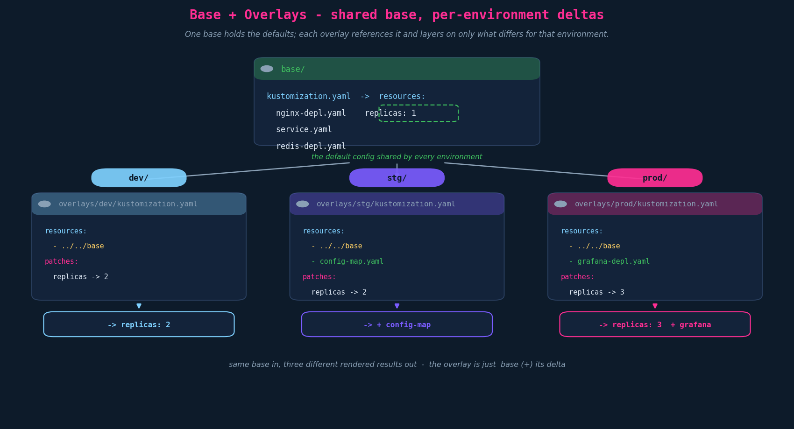
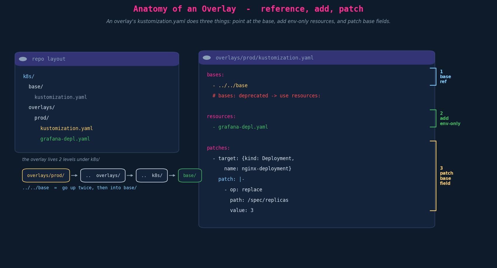

# Overlays — base references, env-only resources, per-env patches

> **Context.** Ch01 introduced base + overlays as the *mental model*; everything since
> (directories, transformers, patches) has been the machinery. This chapter is the payoff:
> how an **overlay** actually wires itself to a **base** and layers on per-environment
> changes. A "base" and an "overlay" aren't special kinds — both are ordinary
> `kustomization.yaml` directories. The only difference is the **role**: the base holds the
> shared default config; the overlay *references* the base and adds/modifies it for one
> environment.

---

## 1. The layout

The conventional shape: one `base/`, and an `overlays/<env>/` per environment.

```
k8s/
├── base/
│   ├── kustomization.yaml        # resources: nginx-depl, service, redis-depl
│   ├── nginx-depl.yaml           # replicas: 1  (the default)
│   ├── service.yaml
│   └── redis-depl.yaml
└── overlays/
    ├── dev/   { kustomization.yaml, config-map.yaml }
    ├── stg/   { kustomization.yaml, config-map.yaml }
    └── prod/  { kustomization.yaml, config-map.yaml }
```

- **base/** — shared/default config for every environment.
- **overlays/<env>/** — environment-specific config that **adds to or modifies** the base.



You **build/apply the overlay**, not the base: `kubectl apply -k overlays/prod`. (The base is
independently buildable for inspection, but it's not what you ship per-env.)

---

## 2. What an overlay's kustomization does

An overlay's `kustomization.yaml` does three jobs:



### 2.1 Reference the base

```yaml
bases:
  - ../../base          # relative to THIS kustomization's directory
```

> **Precision flag — `bases:` is deprecated.** Modern Kustomize treats the base as just
> another resource: a **directory entry under `resources:`**.
> ```yaml
> resources:
>   - ../../base        # the base is "a resource that happens to be a directory"
> ```
> The lecture (and many real repos, including the GKP overlay) still use `bases:`. It works,
> but prefer `resources:` in anything new — and know they mean the same thing when you read
> the deprecated form.

The path `../../base` is resolved **from the overlay's own directory**: from
`overlays/prod/`, `..` → `overlays/`, `..` → `k8s/`, then `base/` → `k8s/base/`.

> **Depth:** because the base reference is just a `resources:` directory entry, an overlay
> can reference **more than one base**, another overlay, or even a **remote/versioned base**:
> `resources: - github.com/org/repo/k8s/base?ref=v1.4.0`. Pinning a tagged remote base is a
> real pattern for sharing platform config across teams.

### 2.2 Add env-only resources

Resources that exist in **one** environment go in that overlay's `resources:` — alongside the
base reference:

```yaml
resources:
  - ../../base
  - grafana-depl.yaml   # prod-only; never touches dev/stg
```

This is how prod can run Grafana while dev/stg don't — without polluting the base (which
would apply it everywhere).

### 2.3 Patch base fields

Per-environment differences to *existing* base fields are **patches** (Ch06–08):

```yaml
patches:
  - target: { kind: Deployment, name: nginx-deployment }
    patch: |-
      - op: replace
        path: /spec/replicas
        value: 3            # prod runs 3; dev runs 2; base default is 1
```

Same base `replicas: 1` in → `2` for dev, `3` for prod out. The overlay is literally
**base (+) its delta**.

---

## 3. Scaling: per-app nested kustomizations

For a multi-app system, both base and overlays can be **nested by app**, each subfolder its
own kustomization (the Ch04 "managing directories" pattern, applied at scale):

```
k8s/
├── base/
│   ├── kustomization.yaml         # resources: db/, api/
│   ├── db/   { db-depl.yaml,  db-service.yaml,  kustomization.yaml }
│   └── api/  { api-depl.yaml, api-service.yaml, kustomization.yaml }
└── overlays/
    ├── dev/
    │   ├── kustomization.yaml      # resources: db/, api/  (or ../../base + patches)
    │   ├── db/   { db-patch.yaml,  kustomization.yaml }
    │   └── api/  { api-patch.yaml, kustomization.yaml }
    └── prod/  { …same shape… }
```

Each app is effectively its own mini base+overlay; the top-level overlay kustomization
composes the per-app overlay directories. This keeps a large system's config navigable
instead of one giant kustomization.

---

## 4. Exam-pattern gotchas

- **Build the overlay, not the base.** `kubectl apply -k overlays/prod` (or
  `kubectl kustomize overlays/prod`). Pointing `-k` at `base/` ships the defaults, not the env.
- **`bases:` vs `resources:`** — both reference a base; `bases:` is the deprecated spelling.
  Recognise either; write `resources:`.
- **Relative paths resolve from the kustomization's own dir.** `../../base` from
  `overlays/<env>/` lands at `k8s/base/`. Miscount the `..` hops and the build can't find the base.
- **Env-only resources live in the overlay's `resources:`,** next to the base ref — not in the base.
- **A patch in the overlay must match a base resource** (right `kind`/`name`), or it patches nothing.
- **An overlay is still a kustomization.** Anything legal in a kustomization (transformers,
  generators, more patches) is legal in an overlay.

---

## 5. Imperative / `kustomize edit` shortcuts

```bash
# scaffold an overlay that points at the base
mkdir -p overlays/prod && cd overlays/prod
kustomize create                          # writes a starter kustomization.yaml
kustomize edit add resource ../../base    # modern base reference (resources:)
kustomize edit add resource grafana-depl.yaml

# preview / ship
kubectl kustomize overlays/prod           # render only
kubectl apply -k overlays/prod            # render + apply
```

---

## 6. JPMC / GKP grounding

This chapter *is* the team's daily workflow. A Kickstart-scaffolded repo (Moneta app on GKP)
is base + per-env overlays, and what you've been studying maps 1:1:

- The overlay references the base with the **deprecated `bases:`** form, then layers on the
  GKP specifics: an **`images:` transformer** (`newName: ${containerImageUri}`), a
  **`namespace: ${namespace}`** transformer, a **`configMapGenerator`** for the Spring profile,
  and env-only resources (CockroachDB egress policy, Calico NetworkPolicy, Contour HTTPProxy).
- **`${containerImageUri}` / `${namespace}` are injected by Jules *before* `kustomize build`** —
  the "three techniques" hybrid: structural overlay + pipeline substitution. The overlay you
  hand-edit is the same `kustomization.yaml` this chapter dissects.
- **You ship the overlay** (`kubectl apply -k overlays/<env>` in the pipeline), namespace-scoped
  by your SEAL-ID RBAC — exactly the "build the overlay, not the base" rule above.

---

## TL;DR

- "Base" and "overlay" are **roles**, not kinds — both are `kustomization.yaml` dirs.
- Layout: `k8s/base/` (shared defaults) + `k8s/overlays/<env>/` (per-env deltas).
- An overlay does three things: **reference the base** (`resources: - ../../base`; legacy
  `bases:`), **add env-only resources**, and **patch base fields**.
- Relative paths resolve from the overlay's own directory; `../../base` = up twice, into `base/`.
- **Build/apply the overlay**, not the base. Scale with **per-app nested** kustomizations.

## Quick recall

- [ ] base vs overlay — special kinds? → No, both are kustomization dirs; difference is role.
- [ ] Modern way to reference a base? → `resources: - ../../base` (legacy `bases:`).
- [ ] Resolve `../../base` from `overlays/prod/`? → `k8s/base/`.
- [ ] Add a prod-only Grafana — where? → the prod overlay's `resources:`, not the base.
- [ ] Change replicas per env — how? → a patch in the overlay targeting the base Deployment.
- [ ] What do you apply? → the overlay (`kubectl apply -k overlays/<env>`).
- [ ] Can a base live remotely? → yes, a versioned git URL under `resources:`.

## Resolved threads

- *(From Ch01) How does an overlay actually reference its base?* → as a directory under
  `resources:` (or the deprecated `bases:`), with a relative path from the overlay's own dir.
- *Do I build the base or the overlay?* → the overlay; it pulls in the base.

## Open threads

- [ ] **Ch10 — Components**: reusable resource+patch bundles opted into by a *subset* of
      overlays (`kind: Component`, referenced via `components:`). → next, closes the section.
- [ ] **`jules.yml` end-to-end trace** still owed: `jules.yml → ${variable} injection →
      kustomize build → rendered manifest` (`${containerImageUri}`, `${namespace}`), pending
      the file share. (This chapter's overlay is exactly where that trace would land.)
